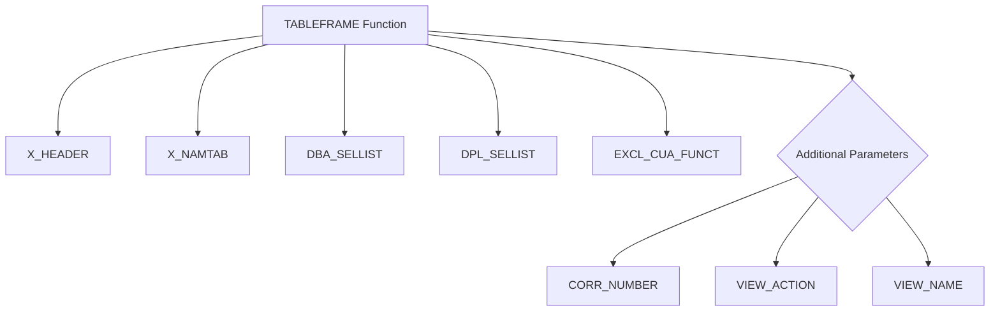

# Function Module TABLEFRAME_Z_LLM_CLIENT

AI Generated documentation.

## Overview

The function module `TABLEFRAME_Z_LLM_CLIENT` is a standard SAP view maintenance generator function designed to handle table frame operations for a custom client-related table. It appears to be an automatically generated function module used for managing view maintenance activities in an SAP ABAP system.

## Dependencies

- Standard SAP View Maintenance Framework
- Performs operations on predefined tables:
  - `X_HEADER`
  - `X_NAMTAB`
  - `DBA_SELLIST`
  - `DPL_SELLIST`
  - `EXCL_CUA_FUNCT`

## Details

The function module utilizes the `PERFORM TABLEFRAME` statement, which is a standard SAP mechanism for view maintenance. It passes several key parameters:

Key characteristics:

- Automatically generated on 02.01.2025
- Part of view maintenance generator version #001407#
- Handles table frame operations for a custom table related to LLM (likely Large Language Model) client configuration
- Provides a standardized interface for view-based table maintenance in SAP

The function is designed to be a generic handler for view-related operations, likely supporting standard CRUD (Create, Read, Update, Delete) actions on the associated table.
