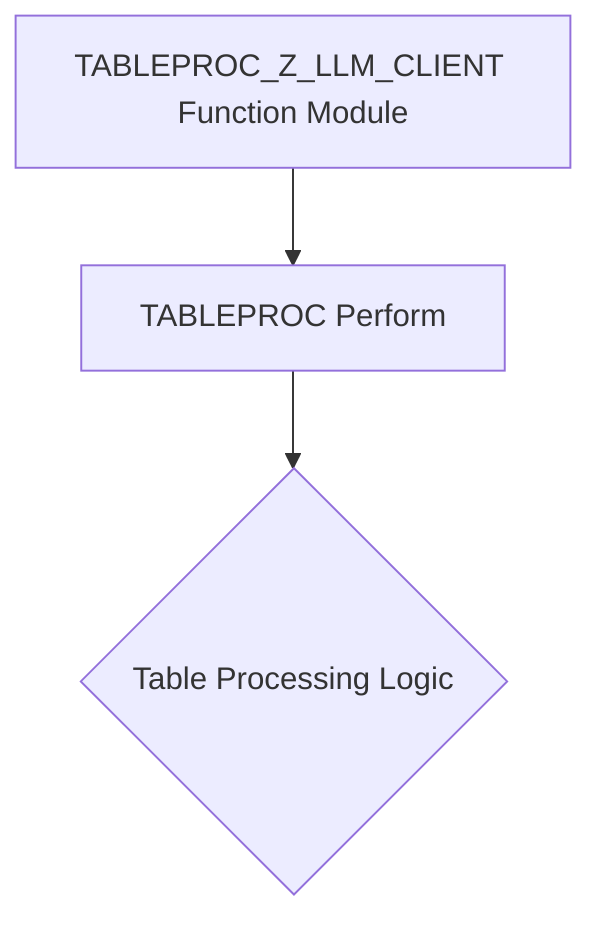

# Function Module TABLEPROC_Z_LLM_CLIENT

AI Generated documentation.

## Overview

The function module `TABLEPROC_Z_LLM_CLIENT` appears to be a generic table processing function generated on 02.01.2025. Its primary purpose seems to be executing a standard table procedure through the `TABLEPROC` perform, which suggests it is likely part of a generated view maintenance or table management framework.

## Dependencies

No explicit dependencies are visible from the provided source code snippet. The function relies on a perform routine `TABLEPROC`, which is likely defined in a common include or standard SAP library.

## Details

The function module is extremely minimal, containing only a single perform call to `TABLEPROC`. This suggests it is:

- Likely part of an automated code generation process
- Probably a wrapper or standardized entry point for table-related operations
- Potentially used in view maintenance or data management scenarios for a client-related table (Z_LLM_CLIENT)

The generation timestamp and version number (#001407#) indicate this is a systematically created function module, possibly generated by a view maintenance tool or custom development framework in SAP.

Without additional context from the common includes, the exact nature of the table processing cannot be definitively determined, but it appears to be a standardized approach to handling table-related operations.
