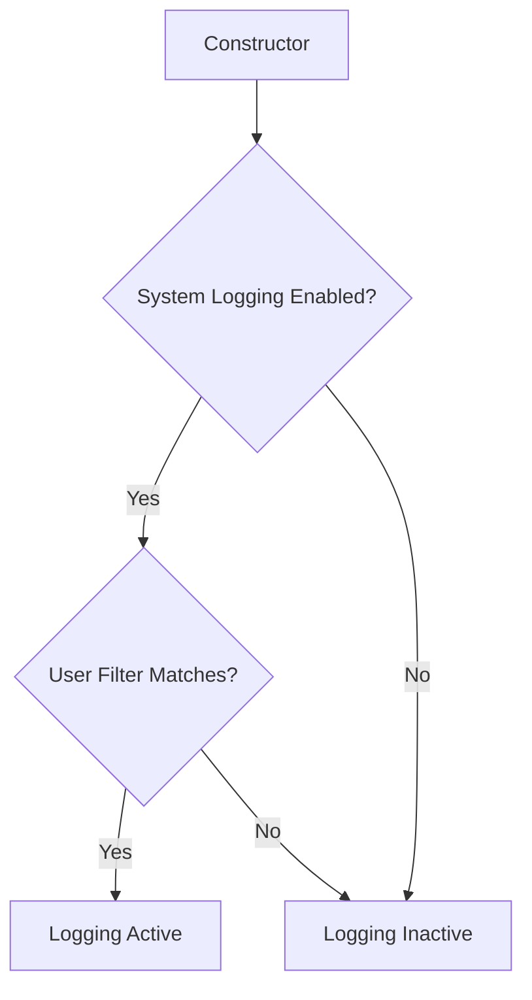

# Class ZCL_LLM_CALL_LOGGER

AI Generated documentation.
## Overview
The `zcl_llm_call_logger` is a specialized ABAP class designed to log LLM (Large Language Model) call entries with configurable logging behavior. It implements the `zif_llm_call_logger` interface and provides a mechanism to conditionally log entries based on system settings and user filters.

Key functionalities:
- Conditional logging of LLM call entries
- System-wide logging activation control
- User-specific logging filter
- Automatic configuration during object instantiation

Public Methods:
- `zif_llm_call_logger~add()`: Logs an entry to the `zllm_call_log` table if logging is active
- `constructor()`: Initializes logging configuration by checking system settings

## Dependencies
- Database Table: `zllm_system` (for system configuration)
- Database Table: `zllm_call_log` (for storing log entries)
- Interface: `zif_llm_call_logger`

## Details
The logging mechanism follows a two-stage filtering process:

Logging Configuration Logic:
1. During object creation, the constructor queries the `zllm_system` table
2. Checks if system-wide logging is enabled (`save_calls = abap_true`)
3. Validates user filter:
   - Matches current user (`sy-uname`)
   - Or allows all users (`call_filter_uname = '*'`)
4. Sets the `active` flag accordingly

When `zif_llm_call_logger~add()` is called:
- Checks the `active` flag
- If active, inserts the entry into `zllm_call_log`
- If inactive, silently returns without logging

This design allows flexible, configurable logging with minimal performance overhead.

