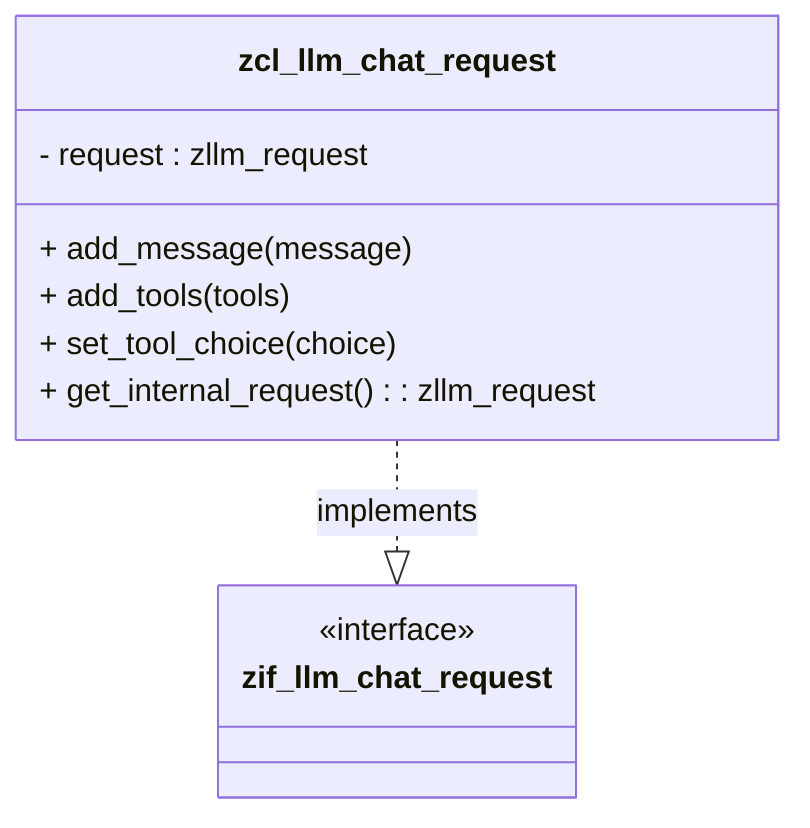

# Class ZCL_LLM_CHAT_REQUEST

AI Generated documentation.

## Overview

The `zcl_llm_chat_request` class is an implementation of the `zif_llm_chat_request` interface, designed to manage and manipulate chat requests for Large Language Model (LLM) interactions. It provides a comprehensive set of methods to:

- Add and manage chat messages
- Handle tools and tool results
- Configure structured output
- Manage tool choices
- Retrieve internal request details

Key public methods include:

- `add_message`: Add a single message to the request
- `add_messages`: Add multiple messages at once
- `add_tool`: Add a tool to the request
- `add_tool_result`: Add a tool result message
- `clear_messages`: Remove all messages
- `clear_tools`: Remove all tools
- `set_tool_choice`: Configure tool selection strategy
- `set_structured_output`: Define structured output schema
- `get_internal_request`: Retrieve the full internal request object

## Dependencies

- `zif_llm_client`: Interface for role constants
- `zcl_llm_common`: Utility class for JSON conversion
- `zllm_request`: Custom data type for storing chat request details

## Details

The class uses a central `request` attribute of type `zllm_request` to store and manage all request-related information. It acts as a builder/configuration class for preparing LLM chat requests with flexible options.

Key design characteristics:

- Implements a fluent interface for building chat requests
- Supports dynamic addition of messages, tools, and tool results
- Provides methods for configuring advanced LLM request features
- Maintains a flexible internal request structure
- Allows retrieval of the complete configured request object

The class is designed to be used as a configuration builder before sending a request to an LLM client, providing a type-safe and structured approach to preparing chat interactions.
