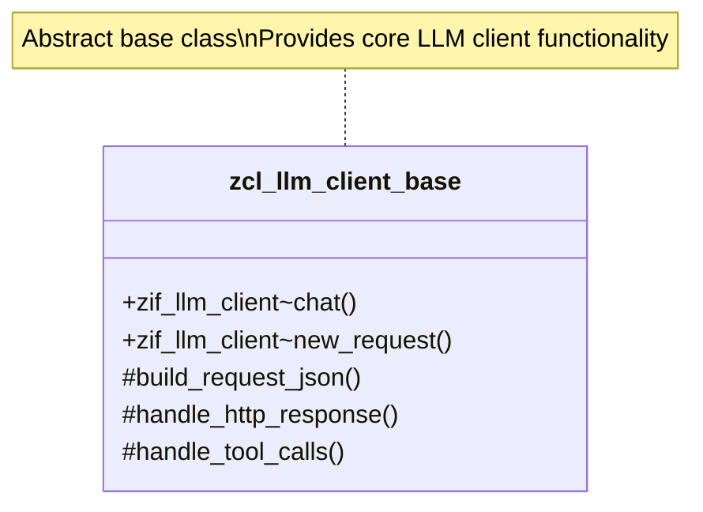

# Class ZCL_LLM_CLIENT_BASE

AI Generated documentation.

## Overview

`zcl_llm_client_base` is an abstract base class for implementing Large Language Model (LLM) clients across different providers. It provides a standardized framework for:

- Creating chat requests
- Handling HTTP communication
- Processing LLM responses
- Managing tool calls and structured outputs

Key public methods:

- `chat()`: Sends a chat request to the LLM provider
- `new_request()`: Creates a new chat request with default configurations
- `get_client()`: Retrieves a provider-specific client implementation

## Dependencies

- `zif_llm_client`: Main client interface
- `zif_llm_http_client_wrapper`: HTTP communication wrapper
- `zif_llm_tool_parser`: Tool parameter parsing
- `zif_llm_statistics`: Statistics tracking

## Details

The class implements a flexible and extensible architecture for LLM interactions with several key design aspects:

Key architectural patterns:

- Abstract methods for provider-specific implementations
- Standardized response and request handling
- Flexible tool call and structured output processing
- Configurable via client and provider configurations

Request processing flow:

1. Create request via `new_request()`
2. Configure request parameters
3. Call `chat()` method
4. Internal methods handle:
   - JSON request building
   - HTTP communication
   - Response parsing
   - Tool call processing

The class supports:

- Multiple LLM providers
- Structured output generation
- Tool call execution
- Detailed usage statistics tracking

Extensibility is achieved through abstract methods like `get_chat_endpoint()`, `set_auth()`, allowing provider-specific implementations while maintaining a consistent interface.
