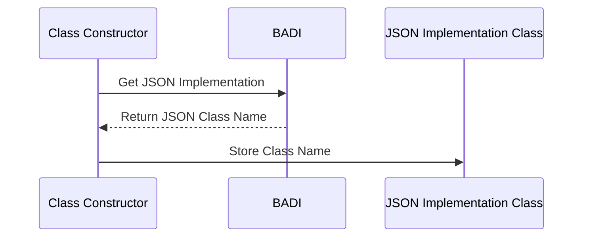

# Class ZCL_LLM_COMMON

AI Generated documentation.

## Overview

The `zcl_llm_common` is a utility class designed to provide JSON serialization and deserialization functionality with dynamic JSON implementation resolution. It offers two primary public methods:

- `to_json()`: Converts ABAP data structures to JSON strings
- `from_json()`: Converts JSON strings back to ABAP data structures

The class uses a dynamically resolved JSON implementation class and supports optional JSON compression.

## Dependencies

- `/ui2/cl_json`: JSON serialization/deserialization utility
- `zllm_implementation` Business Add-In (BADI) for JSON implementation configuration

## Details

The class implements a flexible JSON conversion mechanism through several key design elements:

### Dynamic JSON Implementation Resolution

The `class_constructor` method dynamically retrieves the JSON implementation class through a BADI, allowing runtime configuration of the JSON serialization strategy.

### JSON Conversion Methods

The `to_json()` and `from_json()` methods use dynamic method calls to the resolved JSON implementation class, with the following characteristics:

- Supports low-case property naming
- Optional JSON compression in `to_json()`
- Handles various data structure types

### Configuration Persistence

The class maintains two private class-level attributes:

- `json_class`: Stores the dynamically resolved JSON implementation class name
- `llm_badi`: Holds a reference to the LLM implementation BADI

The `get_llm_badi()` method provides access to the BADI instance, enabling further configuration or interaction if needed.
