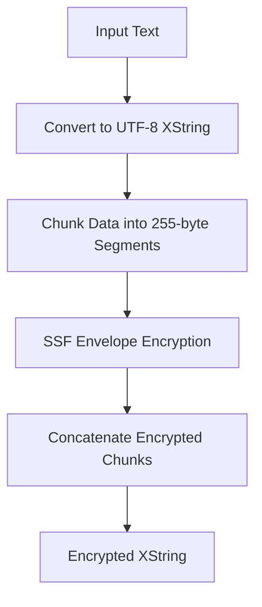

# Class ZCL_LLM_ENCRYPTION

AI Generated documentation.

## Overview

The `zcl_llm_encryption` class provides a robust encryption and decryption mechanism using SAP's Security Services Framework (SSF). It implements the `zif_llm_encryption` interface, offering two primary methods:

- `encrypt`: Converts plain text into an encrypted xstring
- `decrypt`: Converts an encrypted xstring back to its original plain text

The class supports encryption of various text lengths, handling standard and long strings through chunked processing. It ensures secure data transformation with built-in authorization checks.

## Dependencies

- `zif_llm_auth`: Authorization interface for encryption/decryption permission checks
- `zcx_llm_validation`: Custom exception class for handling encryption errors
- SAP Security Services Framework (SSF) function modules:

  - `SSF_KRN_ENVELOPE`
  - `SSF_KRN_DEVELOPE`
  - `SSFC_GET_CERTIFICATE`
  - `SSFC_PARSE_CERTIFICATE`

## Details

The encryption process involves several sophisticated steps:

Key implementation characteristics:

- Uses a fixed chunk size of 255 bytes for handling variable-length inputs
- Retrieves encryption subject and address book from certificate during class initialization
- Performs authorization checks before encryption/decryption
- Handles potential errors with detailed exception handling
- Supports UTF-8 text conversion

The class leverages SAP's built-in cryptographic services to provide a secure, flexible encryption mechanism that can handle diverse text inputs while maintaining data integrity and confidentiality.
