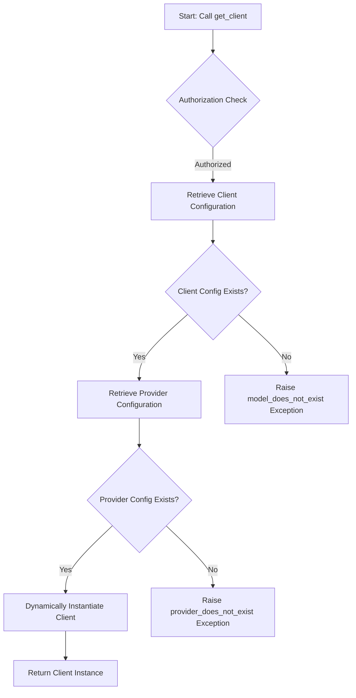

# Class ZCL_LLM_FACTORY

AI Generated documentation.
## Overview
The `zcl_llm_factory` is a factory class for creating Large Language Model (LLM) clients. It provides a centralized mechanism to:
- Validate client and provider configurations
- Dynamically instantiate LLM clients based on configuration
- Enforce authorization checks before client creation

The class implements the `zif_llm_factory` interface, with the primary public method `get_client()` which creates and returns an LLM client for a specified model.

## Dependencies
- `zif_llm_auth`: Authorization interface for checking client creation permissions
- `zllm_clnt_config`: Database table storing client configurations
- `zllm_providers`: Database table storing provider configurations
- `zcx_llm_validation`: Custom exception class for validation errors
- BADI mechanism for flexible authorization implementation

## Details
### Client Creation Process
The `get_client()` method follows a structured validation and instantiation process:

Key implementation details:
- Uses dynamic method call via `CALL METHOD` to instantiate provider-specific clients
- Leverages BADI for flexible authorization implementation
- Performs two-stage validation (client and provider configurations)
- Raises specific validation exceptions for configuration errors

The `class_constructor()` initializes the authorization implementation through a BADI, ensuring a pluggable authorization mechanism.

