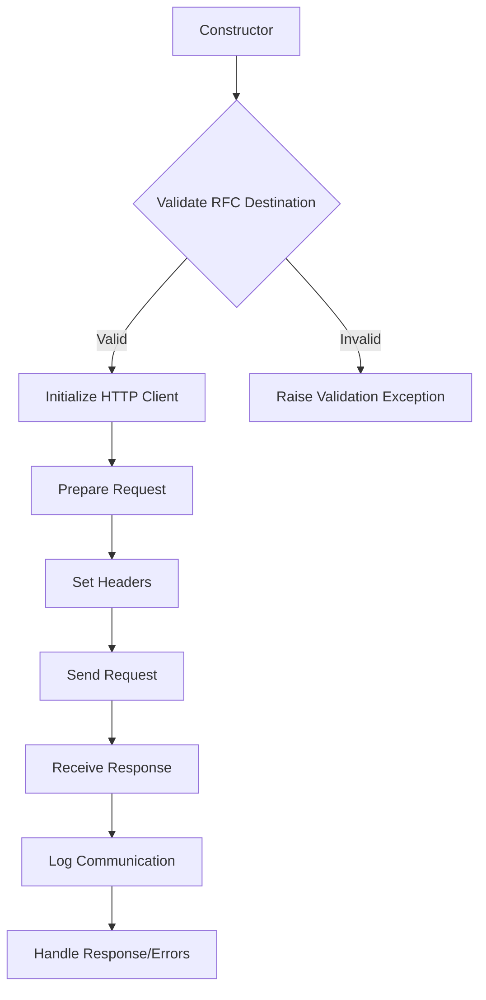

# Class ZCL_LLM_HTTP_CLIENT_WRAPPER

AI Generated documentation.
## Overview
The `zcl_llm_http_client_wrapper` is a private constructor HTTP client wrapper class that provides a robust and flexible interface for making HTTP communications. It implements the `zif_llm_http_client_wrapper` interface and offers methods for creating, configuring, and managing HTTP client interactions. The class is designed to handle HTTP communication with external providers, with built-in error handling and logging capabilities.

Key public methods include:
- `get_client()`: Creates a new HTTP client instance
- `set_header()`: Sets custom HTTP headers
- `set_url()`: Configures the target URL
- `communicate()`: Sends HTTP requests and processes responses
- `close_client()`: Closes the HTTP client connection

## Dependencies
- `if_http_client`: SAP standard HTTP client interface
- `zif_llm_call_logger`: Custom logging interface
- `zcx_llm_validation`: Custom validation exception class
- `zcx_llm_http_error`: Custom HTTP communication error class

## Details
The class follows a comprehensive HTTP communication workflow:

Key implementation details:
- Supports dynamic configuration through `client_config` and `provider_config`
- Automatically sets default headers like 'Content-Type'
- Implements comprehensive error handling for various HTTP communication scenarios
- Integrates with a call logger to record communication details
- Handles response status code validation
- Automatically resets request to prevent header/path prefix contamination between calls

The class is designed with flexibility and robustness in mind, providing a clean abstraction layer over SAP's standard HTTP client functionality while adding enhanced error handling and logging capabilities.

