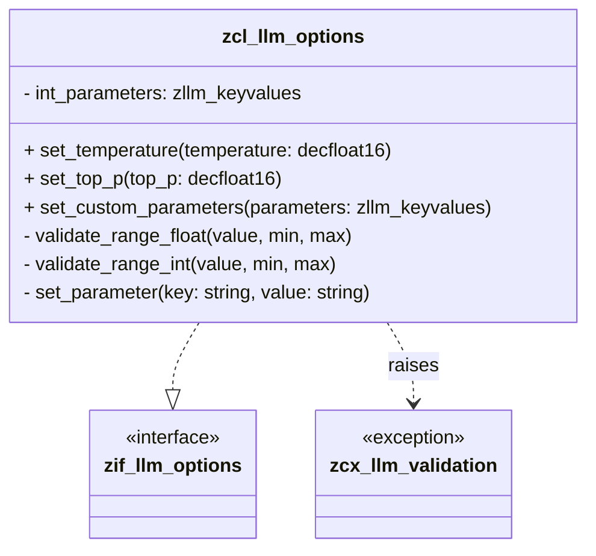

# Class ZCL_LLM_OPTIONS

AI Generated documentation.
## Overview
The `zcl_llm_options` class is a configuration management class for Large Language Model (LLM) parameters. It provides a flexible and type-safe way to set and manage various configuration options for LLM interactions. The class implements the `zif_llm_options` interface and supports setting and validating a wide range of parameters such as temperature, top_p, top_k, seed, frequency penalty, presence penalty, and custom parameters.

Key public methods include:
- `set_temperature`: Set model temperature (0.0 to 2.0)
- `set_top_p`: Set top_p sampling parameter (0.0 to 1.0)
- `set_top_k`: Set top_k sampling parameter (> 0)
- `set_seed`: Set random seed (non-negative integers)
- `set_frequency_penalty`: Set frequency penalty (-2.0 to 2.0)
- `set_presence_penalty`: Set presence penalty (-2.0 to 2.0)
- `set_min_p`: Set minimum probability parameter (0.0 to 1.0)
- `set_top_a`: Set top_a parameter (0.0 to 1.0)
- `set_custom_parameters`: Add or update custom parameters
- `get_parameters`: Retrieve current parameter configuration

## Dependencies
- `zif_llm_options` interface
- `zcx_llm_validation` exception class for parameter validation
- `zllm_keyvalues` type for storing key-value parameters

## Details
The class uses an internal data structure `int_parameters` to store parameters as key-value pairs. Each parameter setting method follows a consistent pattern:
1. Validate the input value using range-specific validation methods
2. Convert the value to a string representation
3. Add or replace the parameter in the internal parameter collection

Validation is performed through two core validation methods:
- `validate_range_float`: Validates floating-point parameters within a specified range
- `validate_range_int`: Validates integer parameters within a specified range

The class provides a robust and extensible mechanism for configuring LLM parameters with built-in type and range validation, ensuring that only valid configurations can be set.

