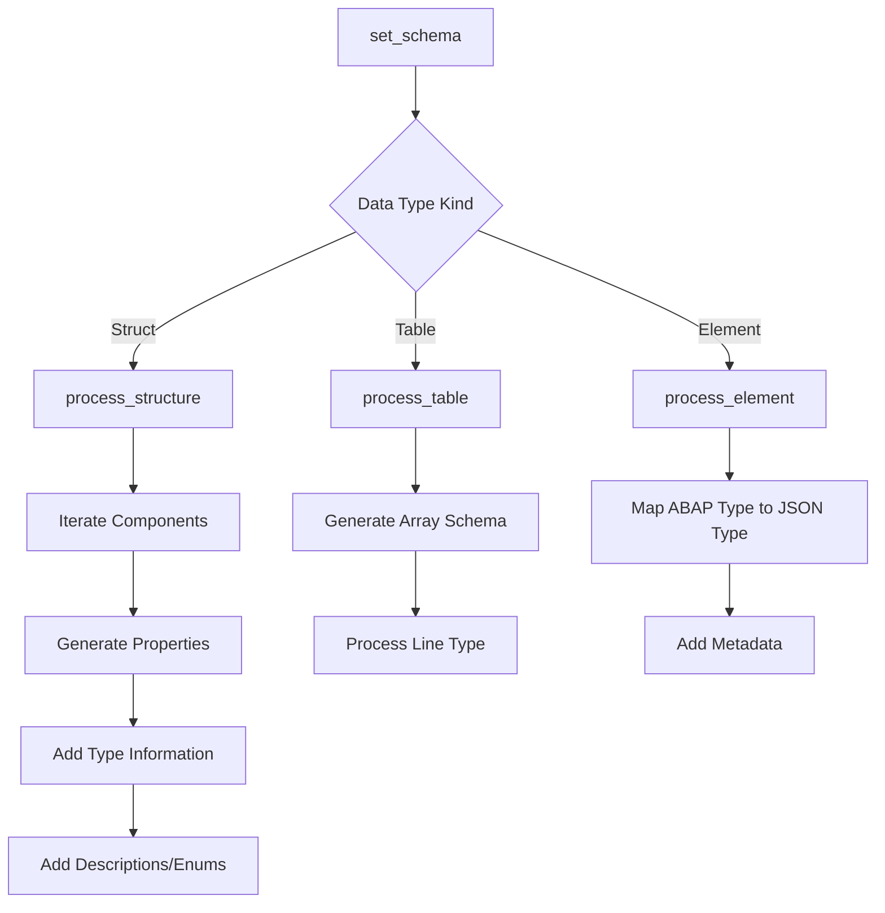

# Class ZCL_LLM_SO_JS

AI Generated documentation.
## Overview
The `zcl_llm_so_js` class is a JSON Schema generator implementation for structured output in ABAP. It implements the `zif_llm_so` interface and provides functionality to convert ABAP data types and structures into a JSON schema representation. The primary purpose is to dynamically generate a JSON schema that describes the structure, types, and metadata of ABAP data types.

Key public methods include:
- `set_schema()`: Main method to generate the JSON schema for a given data type
- `get_schema()`: Retrieves the generated JSON schema
- `get_datatype()`: Returns the original data descriptor

## Dependencies
- `zif_llm_so` interface
- `zcx_llm_validation` exception class for handling unsupported types
- ABAP type description classes (`cl_abap_typedescr`, `cl_abap_structdescr`, `cl_abap_elemdescr`, `cl_abap_tabledescr`)

## Details
The class uses a recursive type processing approach to generate JSON schemas:

Key processing methods:
- `process_type()`: Dispatches processing based on type kind
- `process_structure()`: Handles nested structures, generates object schemas
- `process_table()`: Generates array schemas
- `process_element()`: Converts elementary types to JSON schema types

The implementation supports:
- Nested structures
- Tables and arrays
- Type conversion (int, string, boolean)
- Field descriptions
- Enum values
- Error handling for unsupported types

The schema generation is flexible and can handle complex ABAP data structures, converting them into a standardized JSON schema format that can be used for documentation, validation, or interface description.

