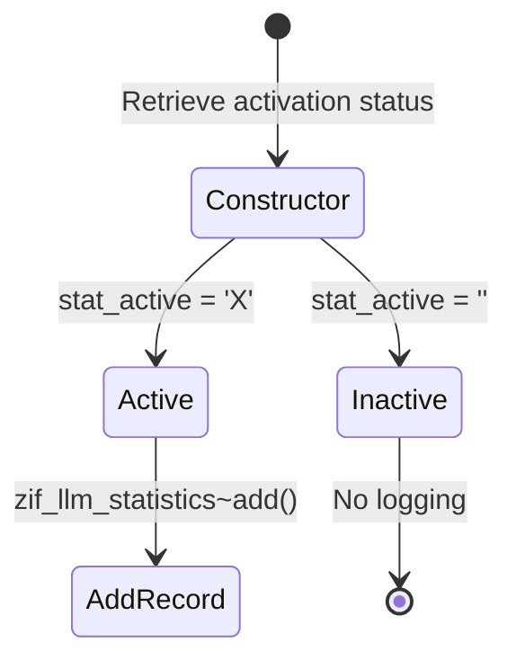

# Class ZCL_LLM_STATISTICS

AI Generated documentation.
## Overview
The `zcl_llm_statistics` class is designed to manage and control the insertion of statistical records into a database table. It provides a flexible mechanism to conditionally log statistics based on a system-wide activation flag. The class implements the `zif_llm_statistics` interface and offers a simple way to add statistical records.

## Dependencies
- Interface: `zif_llm_statistics`
- Database Table: `zllm_statistics`
- Database Table: `zllm_system` (for retrieving activation status)

## Details
The class follows a configuration-driven approach to statistical logging:

Key implementation details:
- The constructor retrieves the statistical logging activation status from the `zllm_system` table
- The `add` method checks the `active` flag before inserting a record
- If statistics are not active, the `add` method immediately returns without logging
- When active, records are directly inserted into the `zllm_statistics` table

The design allows for centralized, configurable statistical logging with minimal performance overhead when disabled.

