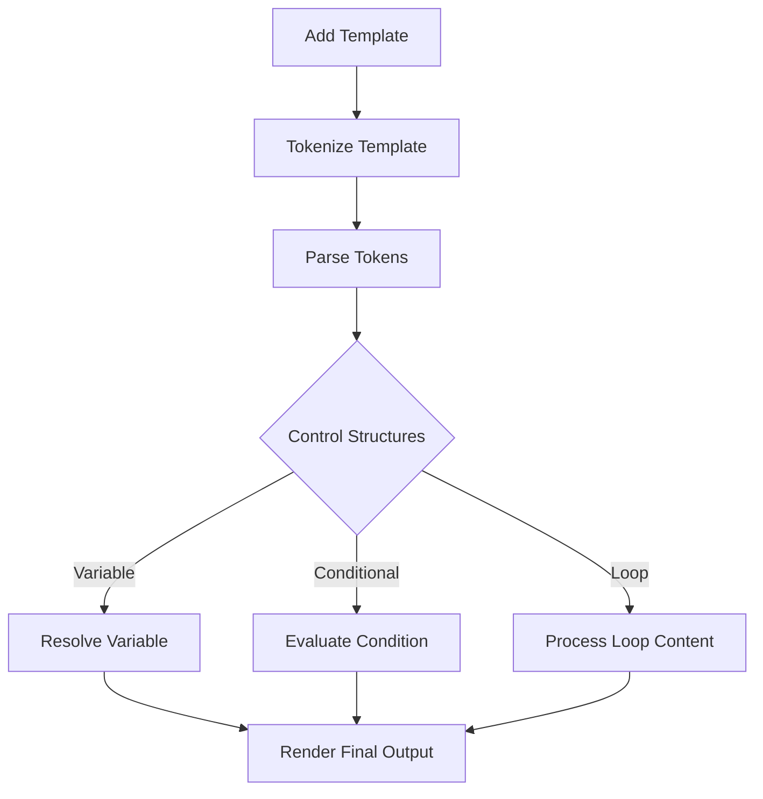

# Class ZCL_LLM_TEMPLATE_PARSER

AI Generated documentation.
## Overview
The `zcl_llm_template_parser` is a sophisticated template rendering class that provides Jinja2-like template processing capabilities in ABAP. It allows developers to:
- Add and manage templates
- Render templates with dynamic context
- Support complex template features like:
  - Variable substitution
  - Conditional rendering
  - Looping
  - Filtering
  - Nested data access

Public methods include:
- `constructor()`: Initializes an empty template collection
- `add_template()`: Adds or replaces a template in the parser
- `render()`: Renders a specific template with a given context

## Dependencies
No external dependencies are required. The class uses standard ABAP type descriptions and type handling mechanisms.

## Details
### Template Processing Architecture
The template parsing follows a multi-stage process:

Key internal mechanisms include:
- Dynamic variable resolution through nested path traversal
- Flexible condition evaluation supporting:
  - Comparison operators
  - Logical AND/OR
  - Negation
- Advanced loop processing with metadata
- Comprehensive error handling for various template parsing scenarios

The parser supports complex template scenarios like:
- Nested data structures
- Conditional rendering with multiple branches
- Iterative processing of tables
- String transformation filters
- Escape character handling

The implementation leverages ABAP's type description capabilities to dynamically inspect and manipulate data structures, providing a powerful and flexible template rendering solution.

