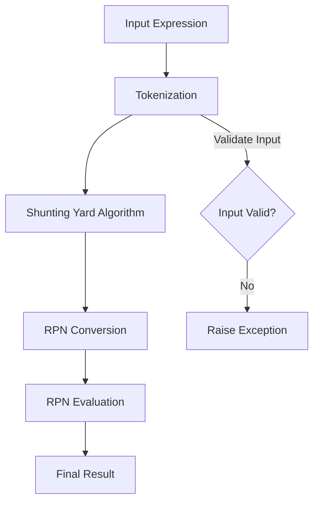

# Class ZCL_LLM_TOOL_CALCULATOR

AI Generated documentation.

## Overview

The `zcl_llm_tool_calculator` is a sophisticated mathematical expression evaluation tool that implements the `zif_llm_tool` interface. It provides a flexible calculator capable of parsing and evaluating complex mathematical expressions, supporting:

- Basic arithmetic operations (+, -, *, /)
- Power operations (**)
- Modulo operation (MOD)
- Parentheses for complex expressions
- Handling of negative numbers
- Error handling for invalid inputs and edge cases

Public methods include:

- `get_tool_details()`: Returns metadata about the calculator tool
- `execute()`: Evaluates a given mathematical expression
- `get_result()`: Retrieves the most recent calculation result

## Dependencies

No external dependencies are explicitly required. The class uses standard ABAP exception classes:

- `cx_sy_zerodivide`
- `cx_sy_arithmetic_error`
- `cx_sy_conversion_no_number`

## Details

The calculator uses the Shunting Yard algorithm for parsing and evaluating expressions, which allows for handling complex mathematical expressions with proper operator precedence.

Key internal processing steps:

1. Expression Tokenization
   - Breaks down input string into tokens (numbers and operators)
   - Handles negative numbers and multi-character operators
   - Validates input characters

2. Conversion to Reverse Polish Notation (RPN)
   - Transforms infix notation to RPN using operator stack
   - Respects operator precedence
   - Handles parentheses

3. RPN Evaluation
   - Uses a value stack to compute final result
   - Applies operators sequentially
   - Supports various arithmetic and power operations

The implementation provides robust error handling, catching scenarios like:

- Division by zero
- Invalid expression syntax
- Unsupported characters
- Insufficient operands

Notably, the class supports advanced features like:

- Negative exponents
- Fractional calculations
- Complex nested expressions with parentheses
