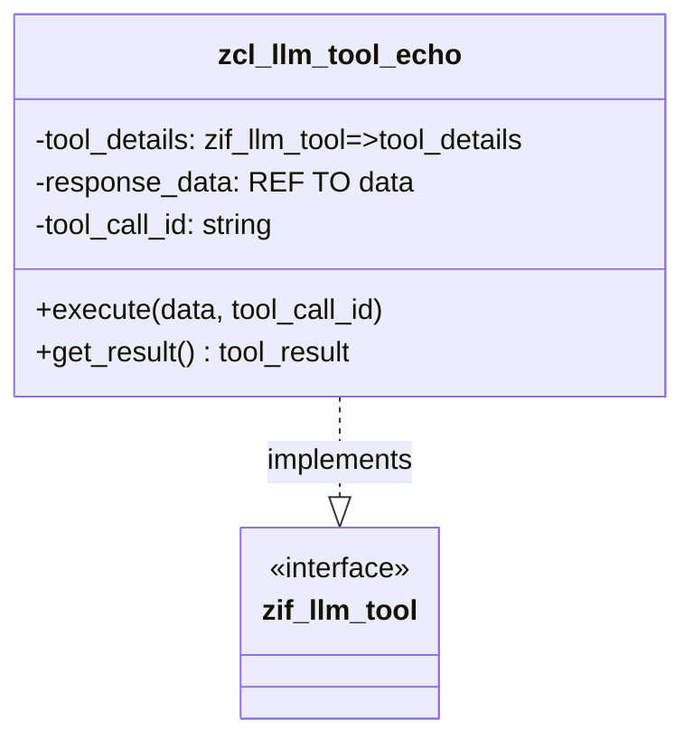

# Class ZCL_LLM_TOOL_ECHO

AI Generated documentation.

## Overview

The `zcl_llm_tool_echo` is a simple tool class implementing the `zif_llm_tool` interface, designed to act as an echo mechanism for tool interactions. Its primary purpose is to return the input data as-is, essentially creating a pass-through or reflection of the received data. The class supports basic tool operations like executing a tool call and retrieving tool details.

Public methods include:

- `get_tool_details()`: Returns the tool's configuration details
- `execute()`: Processes and stores input data
- `get_result()`: Retrieves the processed tool result

## Dependencies

- Interface `zif_llm_tool`: Defines the contract for tool implementations

## Details

The class follows a straightforward design pattern for tool handling:

Key implementation characteristics:

- Stores input data directly in `response_data`
- Preserves the original `tool_call_id`
- Returns the input data without modification
- Designed for scenarios requiring a simple data reflection mechanism

The constructor allows initializing the tool with specific details, while the `execute()` method captures both the data and the tool call identifier for later retrieval.
