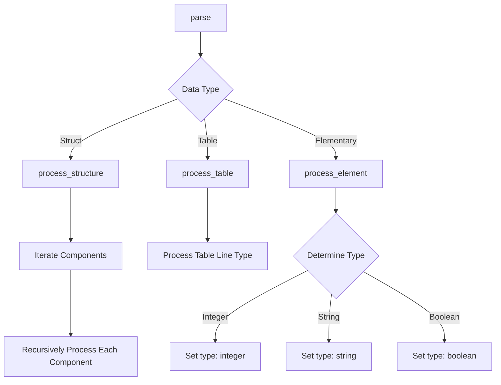

# Class ZCL_LLM_TOOL_PARSER

AI Generated documentation.

## Overview

The `zcl_llm_tool_parser` is a JSON schema generator for ABAP data structures, implementing the `zif_llm_tool_parser` interface. Its primary purpose is to convert ABAP data types into a JSON schema representation, supporting various data types including:

- Elementary types (integers, strings, booleans)
- Structures
- Tables
- Nested structures and tables

The main public method is `parse()`, which generates a JSON schema for a given data structure, handling type detection, descriptions, and enum values.

## Dependencies

- `zif_llm_tool_parser` interface
- `zcx_llm_validation` exception class
- ABAP type descriptor classes (cl_abap_typedescr, cl_abap_structdescr, cl_abap_elemdescr, cl_abap_tabledescr)

## Details

The class uses a recursive parsing approach to generate JSON schemas:

Key parsing strategies:

- Supports nested structures and tables
- Generates titles and descriptions
- Handles enum values
- Validates and raises exceptions for unsupported types
- Converts field names to lowercase
- Generates a "required" array for structure components
- Disables additional properties in objects

The parsing process involves several method calls:

1. `pre_schema()`
2. `process_type()` (recursive type handling)
3. `process_structure()` / `process_table()` / `process_element()`
4. `post_schema()`

The class is designed to be extensible, with empty hook methods like `pre_object()`, `post_array()` that can be overridden in subclasses for custom behavior.
