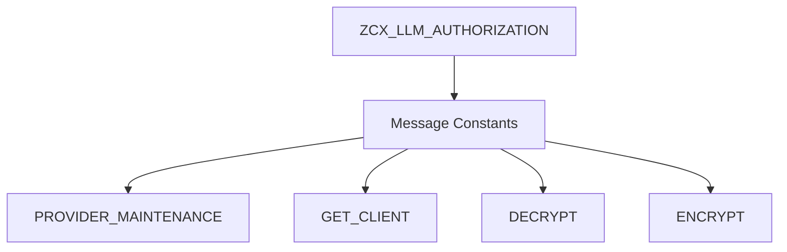

# Class ZCX_LLM_AUTHORIZATION

AI Generated documentation.
## Overview
`ZCX_LLM_AUTHORIZATION` is a custom ABAP exception class designed for handling authorization-related errors in an LLM (Large Language Model) client context. It inherits from `CX_STATIC_CHECK` and implements message interfaces for dynamic and static message handling. The class defines several predefined message constants for different error scenarios related to provider maintenance, client retrieval, decryption, and encryption.

## Dependencies
- `CX_STATIC_CHECK`: Parent exception class
- `IF_T100_DYN_MSG`: Dynamic message interface
- `IF_T100_MESSAGE`: Static message interface

## Details
The exception class provides a flexible error handling mechanism with predefined message constants:

Key characteristics:
- Supports dynamic message creation through message interfaces
- Stores additional message variables `MSGV1` and `MSGV2`
- Constructor method allows flexible exception instantiation with optional text ID and previous exception
- Uses message class 'ZLLM_CLIENT' with specific message numbers for different error scenarios

The constructor method follows a standard ABAP exception handling pattern:
- Calls parent constructor
- Sets default or custom text ID
- Allows chaining of exceptions through the `PREVIOUS` parameter

Typical use cases include:
- Signaling authorization-related errors in LLM client interactions
- Providing detailed error context through message variables
- Supporting centralized error handling in LLM client implementations

