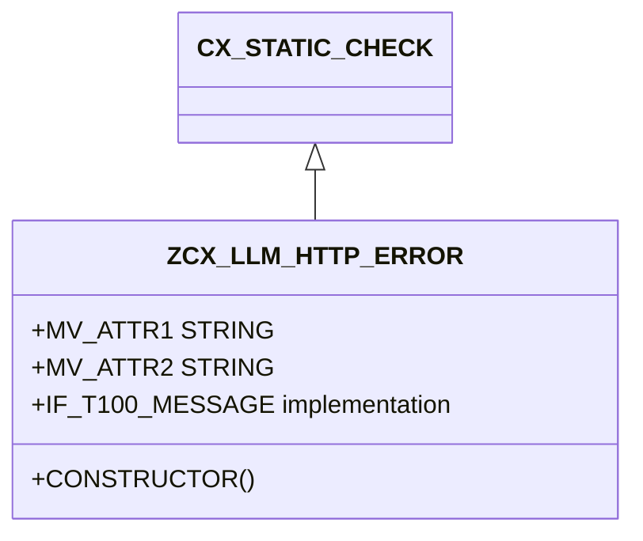

# Class ZCX_LLM_HTTP_ERROR

AI Generated documentation.

## Overview

`ZCX_LLM_HTTP_ERROR` is a custom ABAP exception class designed to handle various HTTP communication errors. It inherits from `CX_STATIC_CHECK` and implements the `IF_T100_MESSAGE` interface, providing a structured way to manage and communicate HTTP-related exceptions in SAP systems.

The class defines four primary error constants:

- `HTTP_CLIENT_NOT_INITIALIZED`: Error when HTTP client is not properly set up
- `HTTP_COMMUNICATION_FAILURE`: Errors during HTTP communication
- `HTTP_PROCESSING_FAILED`: Errors during HTTP request/response processing
- `HTTP_OTHERS`: Catch-all for miscellaneous HTTP errors

## Dependencies

- `CX_STATIC_CHECK`: Parent exception class
- `IF_T100_MESSAGE`: Message interface for SAP message handling

## Details

The exception class is designed with flexibility to capture detailed error information through four string attributes (`MV_ATTR1` to `MV_ATTR4`).

The constructor method allows dynamic error handling by:

- Accepting optional error text ID
- Storing up to four additional error attributes
- Setting default text ID if none provided

The class is particularly useful for standardizing HTTP error handling across ABAP applications, providing a consistent mechanism to raise and process HTTP-related exceptions.
