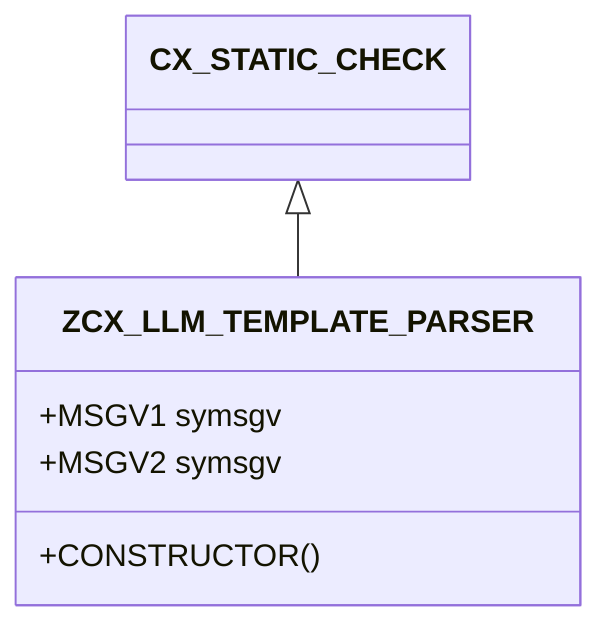

# Class ZCX_LLM_TEMPLATE_PARSER

AI Generated documentation.

## Overview

`ZCX_LLM_TEMPLATE_PARSER` is a custom ABAP exception class designed for handling various parsing and template processing errors in a language model (LLM) template parsing context. It inherits from `CX_STATIC_CHECK` and implements message interfaces `IF_T100_DYN_MSG` and `IF_T100_MESSAGE`.

The class defines numerous predefined error constants covering a wide range of potential parsing issues, such as:

- Unclosed tokens
- Invalid variable paths
- Control structure errors
- Condition evaluation problems
- Loop syntax issues
- Token mismatches

## Dependencies

No external dependencies are evident from the class definition.

## Details

The exception class is structured to provide granular error reporting through message constants. Each error type is defined with:

- A message ID (`ZLLM_CLIENT`)
- A unique message number
- Optional attribute placeholders for dynamic message text

Key error categories include:

- Parsing structural errors (unclosed tokens, control structures)
- Variable resolution problems
- Condition and loop processing issues
- Syntax and semantic validation errors

The constructor method allows flexible exception creation with optional message parameters, supporting dynamic error messaging. The implementation follows standard ABAP exception handling patterns, enabling precise error tracking and reporting during template parsing processes.
