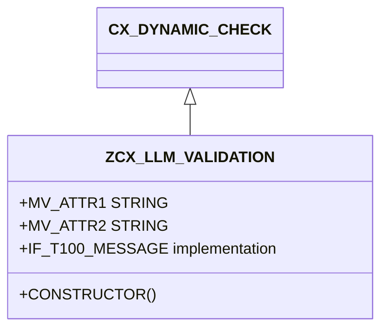

# Class ZCX_LLM_VALIDATION

AI Generated documentation.

## Overview

`ZCX_LLM_VALIDATION` is a custom ABAP exception class designed for handling various validation and error scenarios in a Large Language Model (LLM) client implementation. It inherits from `CX_DYNAMIC_CHECK` and implements the `IF_T100_MESSAGE` interface, allowing for structured error messaging across SAP systems.

The class defines multiple predefined error constants covering scenarios such as:

- Unsupported data types
- Value range violations
- Model-related errors
- HTTP destination issues
- Encryption/decryption problems
- Provider configuration errors

## Dependencies

No external dependencies are explicitly required beyond standard SAP ABAP runtime libraries.

## Details

### Error Constant Structure

Each error constant follows a consistent pattern:

- Message ID (`ZLLM_CLIENT`)
- Unique message number
- Up to two attribute placeholders for dynamic error details

### Constructor Mechanism

The constructor allows flexible error instantiation with optional parameters:

- Dynamic text ID
- Up to four string attributes for error context
- Previous exception reference

The class supports comprehensive error tracking by storing additional context information in `MV_ATTR1` through `MV_ATTR4`, enabling detailed error reporting and troubleshooting in LLM client interactions.
