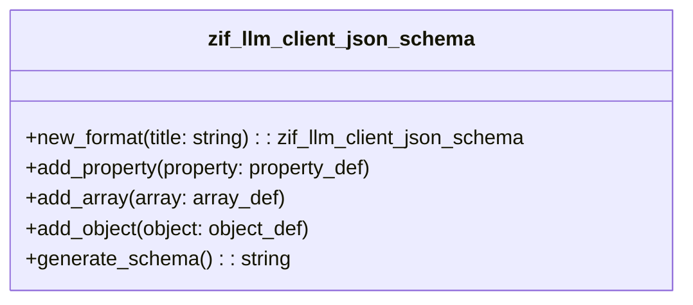

# Interface ZIF_LLM_CLIENT_JSON_SCHEMA

AI Generated documentation.
## Overview

The `zif_llm_client_json_schema` interface provides a structured approach to creating JSON schemas dynamically. It offers methods to:

1. `new_format`: Create a new JSON schema instance with a title
2. `add_property`: Add individual properties to the schema (single level)
3. `add_array`: Add an array of a specific object type
4. `add_object`: Add an object with parameters
5. `generate_schema`: Produce the final JSON schema as a string

The interface supports defining complex JSON structures with various value types:
- Primitive types: string, number, boolean, integer
- Supports nullable properties
- Allows defining properties, objects, and arrays

## Dependencies

- Custom exception class `zcx_llm_validation` for error handling during schema creation

