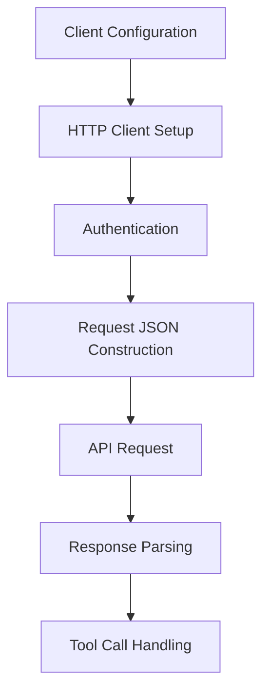

# Class ZCL_LLM_CLIENT_ANTHROPIC

AI Generated documentation.
## Overview
The `zcl_llm_client_anthropic` class is a specialized ABAP implementation for interacting with Anthropic's Language Model (LLM) API. It inherits from a base LLM client class and provides specific implementation for Anthropic's chat message handling, authentication, and request/response processing. The class supports:
- Creating LLM client instances
- Constructing chat requests
- Handling authentication
- Processing API responses
- Supporting tool calls and message parsing

Key public methods:
- `get_client()`: Static method to create a new Anthropic LLM client instance
- `constructor()`: Initializes the client with configuration
- `new_request()`: Overrides base method to set Anthropic-specific request parameters

## Dependencies
- `zcl_llm_client_base`: Base LLM client class
- `zcl_llm_http_client_wrapper`: HTTP client wrapper
- `zcl_llm_common`: Utility class for JSON processing
- BADI implementation for authentication encryption

## Details
The class implements several key methods to adapt to Anthropic's specific API requirements:

Key implementation details:
- Handles system and non-system messages differently
- Supports tool calls with dynamic tool definition
- Manages Anthropic-specific message and response structures
- Implements custom JSON request building
- Handles authentication via API key
- Provides error handling and token usage tracking

Notable technical aspects:
- Uses custom types for Anthropic-specific message and response structures
- Supports max tokens configuration (8192 for current models)
- Handles tool calls and results mapping
- Provides flexible authentication mechanism with optional encryption

The implementation demonstrates a robust, extensible approach to integrating with the Anthropic LLM API, allowing for flexible chat interactions and tool usage within the SAP ABAP environment.

