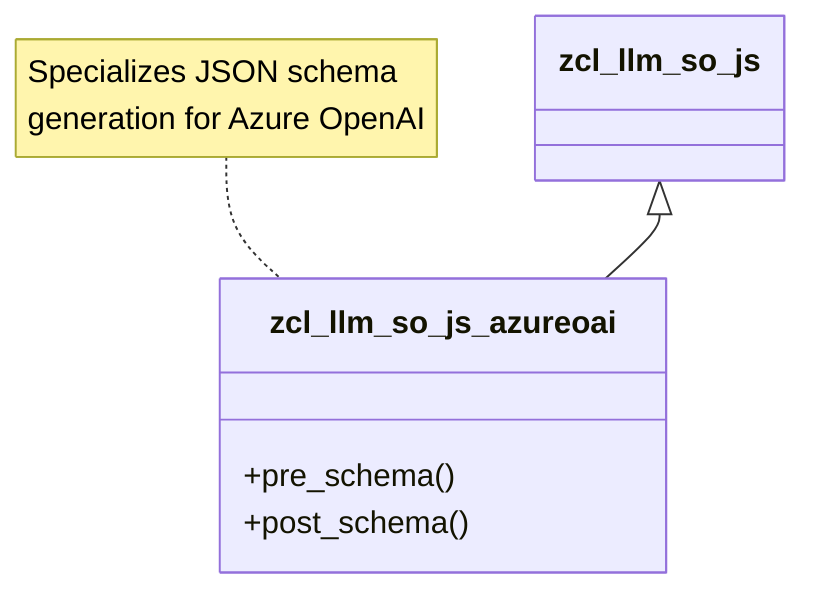

# Class ZCL_LLM_SO_JS_AZUREOAI

AI Generated documentation.
## Overview
The `zcl_llm_so_js_azureoai` is a specialized ABAP class for implementing JSON schema generation specific to Azure OpenAI. It inherits from a base JSON schema class (`zcl_llm_so_js`) and provides custom schema construction through method overrides. The class is designed as a final, public class with a focused implementation for Azure OpenAI response schema generation.

## Dependencies
- Base class: `zcl_llm_so_js`

## Details
The class modifies the JSON schema generation process through two key protected methods:

1. `pre_schema()`: 
   - Initiates the schema construction
   - Adds a predefined JSON structure with a "Response" name and strict validation setting
   - Uses `append_to_schema()` method inherited from the base class

2. `post_schema()`:
   - Closes the JSON schema structure by appending a closing curly brace

The implementation suggests a template method pattern where the base class provides the core schema generation logic, and this subclass customizes specific aspects of schema construction for Azure OpenAI's specific requirements.

