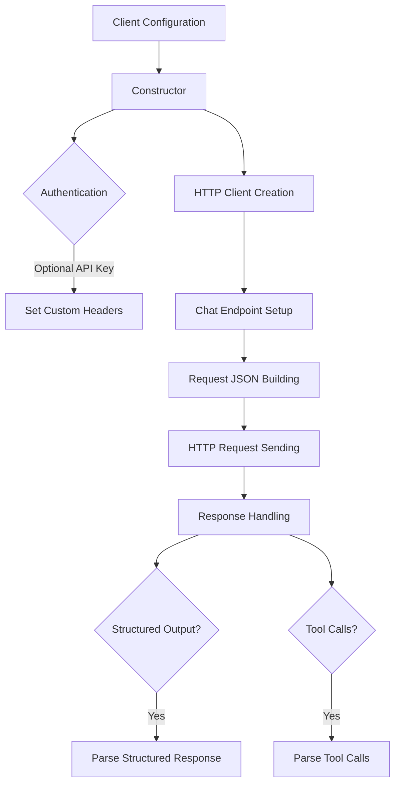

# Class ZCL_LLM_CLIENT_OLLAMA

AI Generated documentation.

## Overview

The `zcl_llm_client_ollama` is a specialized ABAP class for interacting with the Ollama Large Language Model (LLM) provider. It inherits from a base LLM client class and implements provider-specific methods for communication with the Ollama API. The class supports:

- Creating an Ollama client instance
- Handling authentication
- Building JSON requests
- Processing HTTP responses
- Supporting structured output and tool calls

Key public methods:

- `get_client()`: Static method to create a new Ollama client instance
- `constructor()`: Initializes the client with configuration

## Dependencies

- `zcl_llm_http_client_wrapper`: HTTP client creation
- `zcl_llm_common`: Utility methods for JSON handling
- `zif_llm_client`: Client interface
- `zif_llm_chat_request`: Chat request interface

## Details

The class implements several specialized methods to adapt the generic LLM client to Ollama's specific API requirements:

Key implementation details:

- Supports optional API key authentication via custom headers
- Handles Ollama-specific JSON request formatting
- Manages structured output requests
- Processes tool calls with dynamic parsing
- Provides error handling for HTTP responses and tool call parsing

The class is designed to be flexible, supporting various Ollama API configurations while maintaining a consistent interface with the base LLM client class.
