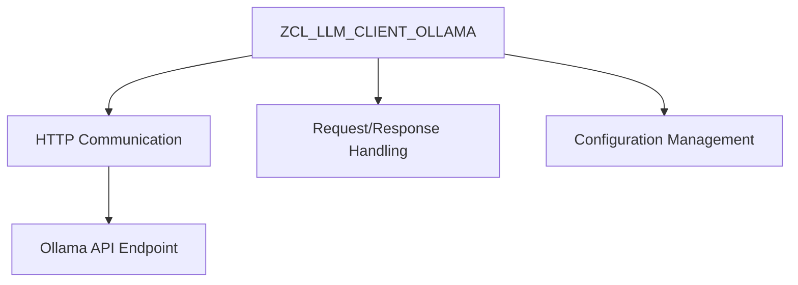

# Package ZLLM_CLIENT_OLLAMA

AI Generated documentation.

## Overview

The ABAP development package centered around the Ollama Large Language Model (LLM) client provides a comprehensive solution for integrating advanced AI-powered language processing capabilities directly into SAP systems. The package enables seamless communication with the Ollama API, allowing developers to leverage generative AI functionalities within ABAP applications.

## Key Features

The package offers a robust implementation for interacting with Ollama's LLM services, featuring:

- Flexible API communication and authentication
- Generative text processing capabilities
- Error handling and response management
- Configurable LLM interactions across different SAP contexts

## Technical Architecture

The architecture is designed to provide a clean, abstracted interface for consuming LLM services while maintaining SAP ABAP best practices for enterprise software integration.

## Use Cases

- Intelligent text generation
- Automated content creation
- Natural language processing tasks
- AI-assisted business logic enhancement

## Technical Considerations

The implementation focuses on secure, performant integration with external AI services, ensuring enterprise-grade reliability and maintainability within the SAP ecosystem.
