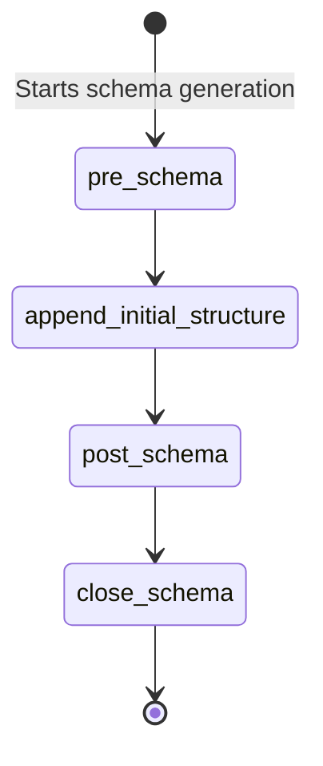

# Class ZCL_LLM_SO_JS_OA

AI Generated documentation.
## Overview
The `zcl_llm_so_js_oa` class is a specialized implementation for OpenAI JSON Schema generation. It inherits from the base class `zcl_llm_so_js` and provides custom schema construction logic through two protected methods: `pre_schema` and `post_schema`. The class is final and publicly creatable, indicating it's a specific implementation for OpenAI-related JSON schema generation.

## Dependencies
- Base class: `zcl_llm_so_js`

## Details
The class extends the base JSON schema generation class with two key method overrides:

### pre_schema Method
- Adds the initial JSON schema structure
- Appends a predefined JSON fragment with:
  - Name set to "Response"
  - Strict mode enabled
  - Starts the schema definition

### post_schema Method
- Closes the JSON schema structure
- Appends a closing curly brace to complete the schema

The implementation suggests a template method pattern where the base class provides the overall schema generation framework, and this specific implementation adds OpenAI-specific schema construction logic.

