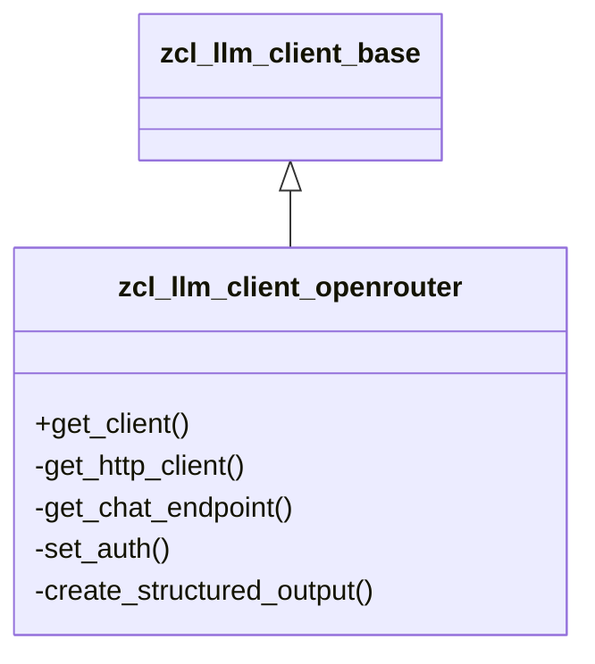

# Class ZCL_LLM_CLIENT_OPENROUTER

AI Generated documentation.

## Overview

The `zcl_llm_client_openrouter` is a specialized ABAP class for interacting with the OpenRouter AI service. It inherits from a base LLM client class and provides implementation-specific methods for authentication, HTTP client configuration, and chat endpoint management. The class is designed to be created privately and accessed through the `get_client` class method, ensuring controlled instantiation.

Public methods include:

- `get_client()`: Static method to create and return an instance of the OpenRouter LLM client
- `constructor()`: Initializes the client with configuration parameters

## Dependencies

- `zcl_llm_client_base`: Base class for LLM clients
- `zcl_llm_http_client_wrapper`: HTTP client wrapper for network communication
- `zcl_llm_common`: Utility class for common LLM operations
- BADI implementation for encryption

## Details

The class implements several key methods to customize OpenRouter-specific interactions:

Key implementation details:

- Adds custom HTTP headers for OpenRouter tracking (`HTTP-Referer` and `X-Title`)
- Supports encrypted authentication through a BADI encryption implementation
- Uses a Bearer token for authorization
- Creates a custom structured output object specific to OpenRouter responses

Authentication flow:

1. Decrypt authentication token if encrypted
2. Set Authorization header with Bearer token
3. Configure HTTP client with specific OpenRouter headers

The class follows a strategy of encapsulating provider-specific logic while maintaining a consistent interface through the base LLM client class.
