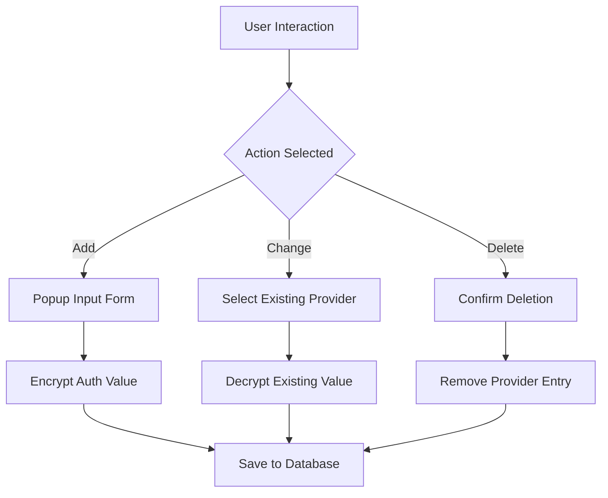

# Report ZLLM_PROVIDER_MAINTENANCE

AI Generated documentation.

## Overview

This ABAP report provides a maintenance transaction for managing Large Language Model (LLM) provider configurations. The application allows users to:

- Add new provider configurations
- Modify existing provider configurations
- Delete provider configurations
- Display provider details in an ALV grid

The report is structured using two main classes:

- `lcl_app`: Handles core application logic and data management
- `lcl_screen`: Manages screen interactions and user interface events

## Dependencies

- Custom table `ZLLM_PROVIDERS` for storing provider configurations
- Encryption interface `ZIF_LLM_ENCRYPTION` for securing authentication values
- Custom exception class `ZCX_LLM_AUTHORIZATION`

## Details

The report implements a comprehensive provider configuration management system with the following key features:

Key technical aspects:

- Uses dynamic field catalog generation for ALV display
- Implements encryption/decryption of sensitive authentication values
- Supports multi-step input handling for provider configurations
- Provides error handling for encryption/decryption operations

The application follows a typical ABAP MVP (Model-View-Presenter) pattern with:

- Data model in `provider_config` type
- View management in `lcl_screen`
- Business logic in `lcl_app`

Encryption is dynamically retrieved via a Business Add-In (BADI) implementation, allowing flexible encryption strategies.
