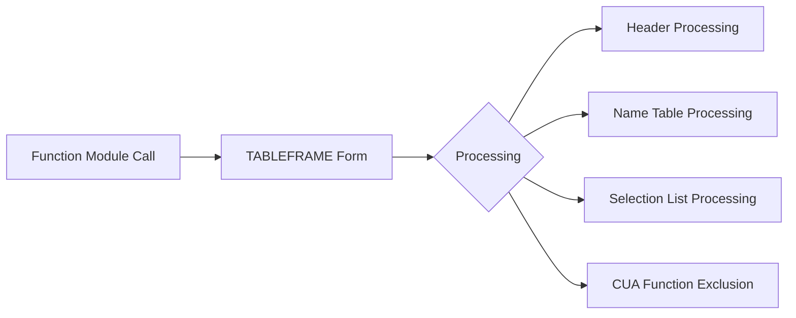

# Function Module TABLEFRAME_Z_LLM_CLIENT

AI Generated documentation.
## Overview
This function module `TABLEFRAME_Z_LLM_CLIENT` is a standard SAP table maintenance framework component. It serves as the main entry point for table maintenance operations on the `Z_LLM_CLIENT` table. The module executes a single PERFORM statement calling the `TABLEFRAME` subroutine with parameters for header information, name tables, selection lists, and excluded functions.

## Dependencies
- Table maintenance framework components (implicit)
- Form routine `TABLEFRAME`
- Global variables:
  - X_HEADER
  - X_NAMTAB
  - DBA_SELLIST
  - DPL_SELLIST
  - EXCL_CUA_FUNCT
  - CORR_NUMBER
  - VIEW_ACTION
  - VIEW_NAME

## Details
The function module follows SAP's standard table maintenance generator pattern. It was generated on January 2nd, 2025 using generator version #001407#.

The function module acts as a wrapper, delegating the actual table maintenance functionality to the TABLEFRAME form routine. This architecture is typical for SAP table maintenance frameworks, providing a standardized interface for table operations while encapsulating the implementation details in the form routine.

