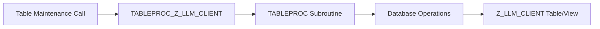

# Function Module TABLEPROC_Z_LLM_CLIENT

AI Generated documentation.

## Overview

This is a table maintenance function module `TABLEPROC_Z_LLM_CLIENT` that appears to be automatically generated for view maintenance. It serves as a standard SAP table maintenance processor, typically used to maintain data in the corresponding database table or view `Z_LLM_CLIENT`. The function module consists of a single PERFORM statement calling the standard `TABLEPROC` subroutine.

## Dependencies

- Standard SAP table maintenance framework
- Database table/view `Z_LLM_CLIENT`
- TABLEPROC standard subroutine

## Details

The function module follows SAP's standard pattern for table maintenance generators. Based on the generation date (02.01.2025) and version information (#001407#), it's a relatively recent implementation.

The process flow can be visualized as follows:

The function module acts as a wrapper for the standard table maintenance functionality, providing a standardized interface for:

- Display and modification of table entries
- Input validation
- Authorization checks
- Database operations (Create, Read, Update, Delete)

The naming convention suggests this is related to a client-specific implementation within a larger LLM (likely Logical License Management or similar) system.
