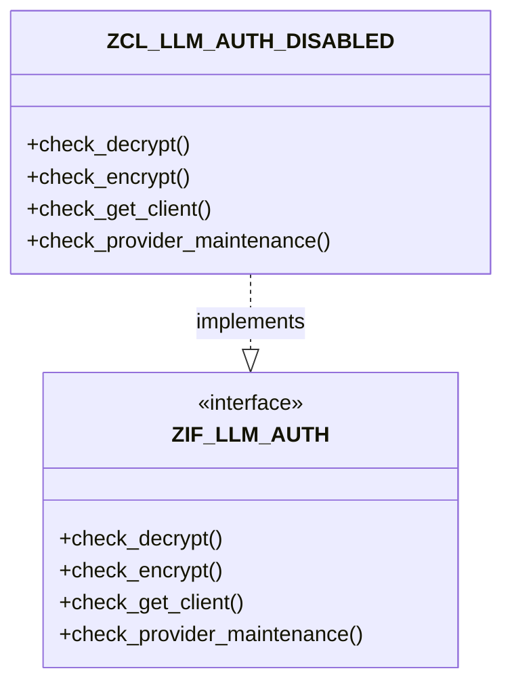

# Class ZCL_LLM_AUTH_DISABLED

AI Generated documentation.
## Overview
The `ZCL_LLM_AUTH_DISABLED` class implements the `ZIF_LLM_AUTH` interface and provides a disabled authorization checker implementation. It contains four public methods that perform no authorization checks:

- `CHECK_DECRYPT`: Allows decryption operations without restrictions
- `CHECK_ENCRYPT`: Allows encryption operations without restrictions  
- `CHECK_GET_CLIENT`: Allows client access without restrictions
- `CHECK_PROVIDER_MAINTENANCE`: Allows provider maintenance operations without restrictions

This implementation acts as a "no-op" authorization checker that permits all operations by default. It can be used in scenarios where authorization checks need to be bypassed or disabled.

## Dependencies
- Interface: `ZIF_LLM_AUTH`
- Exception Class: `ZCX_LLM_AUTHORIZATION` (referenced but not raised)
- BAdI: `ZLLM_DEFAULTS` (referenced in comments for custom implementations)

## Details
The class follows a simple implementation pattern where all authorization check methods are empty and do not perform any actual validation. This creates a permissive authorization environment.

The class is designed to be extensible through the ZLLM_DEFAULTS BAdI, where custom implementations can be registered to add actual authorization checks if needed. Each method contains a comment indicating that custom implementations should raise the ZCX_LLM_AUTHORIZATION exception when access is not allowed.

