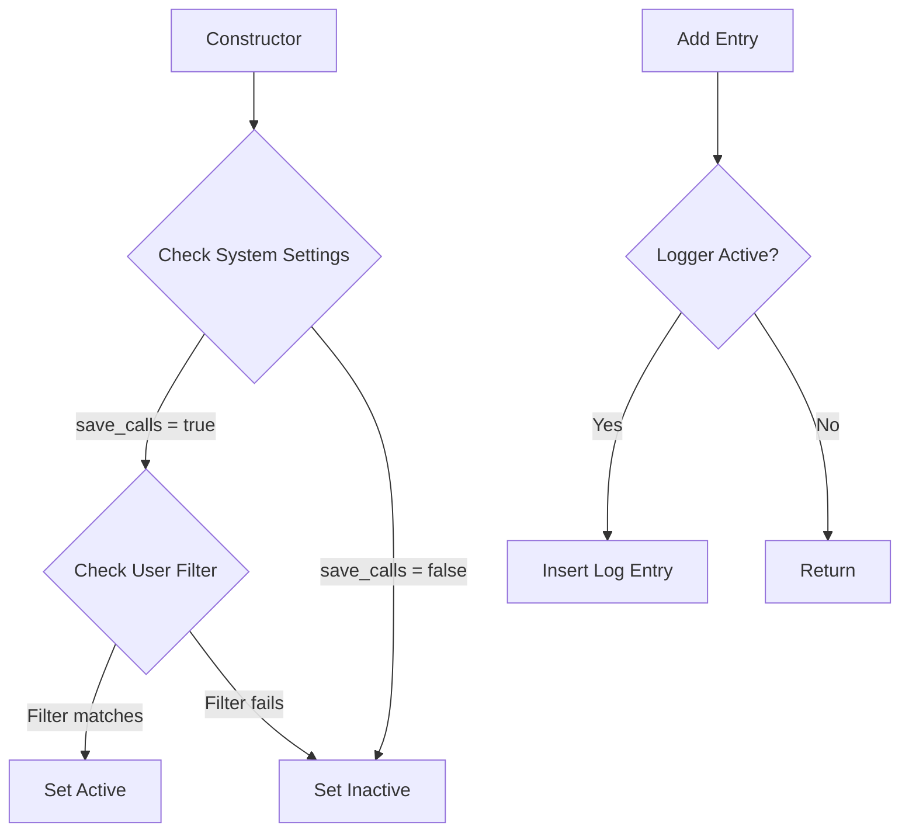

# Class ZCL_LLM_CALL_LOGGER

AI Generated documentation.

## Overview

The `ZCL_LLM_CALL_LOGGER` class implements the `ZIF_LLM_CALL_LOGGER` interface and provides logging functionality for LLM (Large Language Model) calls. The class offers:

- Constructor that initializes the logging state based on system configuration
- Add method (via interface) to log LLM call entries
- Configurable logging activation based on system settings and user filters

Public methods:

- `CONSTRUCTOR`: Initializes the logger
- `ZIF_LLM_CALL_LOGGER~ADD`: Adds a log entry if logging is active

## Dependencies

- Database table `ZLLM_CALL_LOG`: Stores the actual log entries
- Database table `ZLLM_SYSTEM`: Contains system configuration for logging
- Interface `ZIF_LLM_CALL_LOGGER`: Defines the logging contract

## Details

The class implements a conditional logging mechanism with two main decision points:

Key implementation aspects:

- The logger's active state is determined once during instantiation
- User filtering supports wildcard (*) for all users or specific username matching
- Log entries are only written if the logger is active, providing performance optimization
- The implementation uses database tables for both configuration and storage
- The design follows a fail-fast pattern in the add method to minimize overhead when logging is disabled
