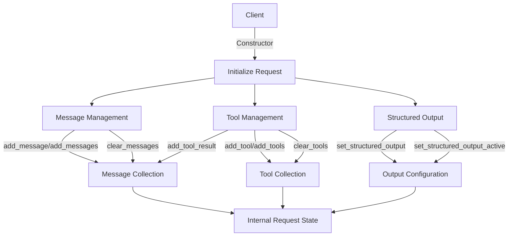

# Class ZCL_LLM_CHAT_REQUEST

AI Generated documentation.

## Overview

The `zcl_llm_chat_request` class implements the `zif_llm_chat_request` interface and manages chat requests for a language learning model (LLM) system. It provides functionality to:

- Manage messages (add, clear, retrieve)
- Handle tools and tool results
- Configure structured output settings
- Manage tool choices

Key public methods:

- `add_message/add_messages`: Add single or multiple messages to the request
- `add_tool/add_tools`: Add single or multiple tools with optional tool choice settings
- `add_tool_result`: Convert tool results to messages
- `set_structured_output`: Configure structured output schema and settings
- `get_internal_request`: Retrieve the internal request state
- `clear_messages/clear_tools`: Reset message or tool collections

## Dependencies

- `zif_llm_chat_request`: Interface implemented by this class
- `zif_llm_client`: Interface providing role definitions
- `zcl_llm_common`: Utility class for JSON conversion
- `zllm_request`: Structure type for internal request state
- `zllm_msg`: Structure type for messages

## Details

The class follows a stateful design pattern where the internal request state is maintained throughout the object's lifecycle. The interaction flow can be visualized as follows:

The class maintains separation of concerns between:

1. Message handling (chat history, tool results)
2. Tool management (available tools, tool choices)
3. Structured output configuration

All operations modify the internal `request` instance variable, which can be accessed via `get_internal_request`. The class acts as a facade, providing a simplified interface for managing complex chat request configurations.
