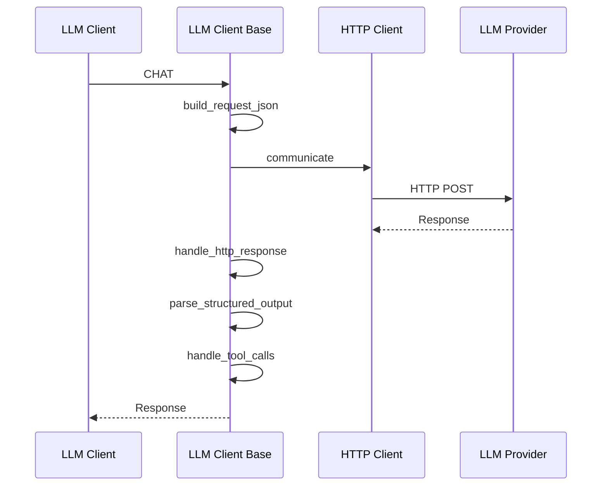

# Class ZCL_LLM_CLIENT_BASE

AI Generated documentation.

## Overview

The `ZCL_LLM_CLIENT_BASE` is an abstract base class for implementing Large Language Model (LLM) clients. It provides core functionality for:

- Managing LLM client configurations and provider settings
- Handling HTTP communication with LLM providers
- Processing chat requests and responses
- Supporting structured outputs and tool calls
- Collecting usage statistics

Public methods:

- `CONSTRUCTOR`: Initializes client with configuration and provider settings
- `CHAT`: Executes chat requests to the LLM provider
- `NEW_REQUEST`: Creates a new chat request with default parameters
- `GET_CLIENT`: Factory method to instantiate specific provider clients

## Dependencies

- `ZIF_LLM_CLIENT`: Interface defining LLM client contract
- `ZIF_LLM_HTTP_CLIENT_WRAPPER`: Interface for HTTP communication
- `ZIF_LLM_TOOL_PARSER`: Interface for parsing tool definitions
- `ZIF_LLM_STATISTICS`: Interface for usage statistics collection
- `ZCL_LLM_TOOL_PARSER`: Implementation of tool parsing
- `ZCL_LLM_COMMON`: Utility class for JSON handling

## Details

The class implements a template pattern where provider-specific implementations must implement abstract methods:

- `GET_HTTP_CLIENT`
- `SET_AUTH`
- `GET_CHAT_ENDPOINT`

The chat request flow:

Key features:

- Supports structured JSON output schemas
- Handles tool definitions and calls
- Provides error handling and retry logic
- Collects usage statistics per request
- Manages authentication and endpoints
- Supports custom provider configurations

The class uses a modular design allowing different providers to be implemented while reusing common functionality for request/response handling, tool management and statistics collection.
