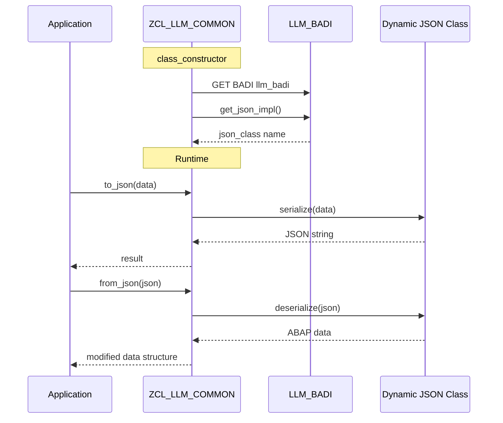

# Class ZCL_LLM_COMMON

AI Generated documentation.

## Overview

The `ZCL_LLM_COMMON` class provides utility methods for JSON serialization/deserialization and LLM (Language Learning Model) BADI handling. The class offers three main public methods:

- `TO_JSON`: Converts ABAP data structures to JSON strings with optional compression
- `FROM_JSON`: Deserializes JSON strings back into ABAP data structures
- `GET_LLM_BADI`: Returns a reference to the LLM implementation BADI

The class uses class constructor initialization to set up the JSON implementation class and BADI handling.

## Dependencies

- BADI: `ZLLM_IMPLEMENTATION` - Used for LLM implementation handling
- Dynamic JSON class (determined via BADI) - Used for JSON serialization/deserialization
- `/UI2/CL_JSON` - Used for JSON pretty printing configuration

## Details

The class implements a flexible architecture that allows switching JSON implementations through a BADI mechanism. The initialization flow and runtime interactions can be visualized as follows:

The class uses late binding to call the JSON implementation methods, allowing for flexibility in the actual JSON processing implementation. The JSON class name is stored in the private `json_class` attribute and is used for dynamic method calls. All JSON operations use lowercase property names (pretty_mode-low_case) for consistency.
