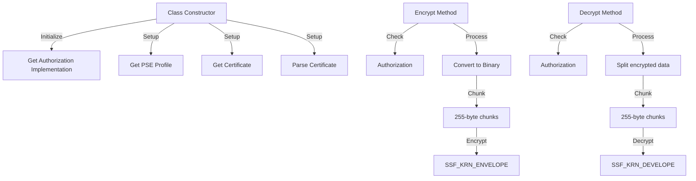

# Class ZCL_LLM_ENCRYPTION

AI Generated documentation.

## Overview

The `ZCL_LLM_ENCRYPTION` class provides encryption and decryption functionality using SAP's Secure Store and Forward (SSF) infrastructure. It implements the `ZIF_LLM_ENCRYPTION` interface and offers two main public methods:

- `ENCRYPT`: Encrypts a string input using SSF envelope encryption
- `DECRYPT`: Decrypts previously encrypted data back to its original string form

The class handles initialization of encryption certificates and profiles during class construction and supports processing of both small and large data volumes through chunked processing.

## Dependencies

- `ZIF_LLM_ENCRYPTION`: Interface implemented by this class
- `ZIF_LLM_AUTH`: Authorization interface for encryption/decryption checks
- SAP SSF Function Modules:
  - `SSF_KRN_ENVELOPE`
  - `SSF_KRN_DEVELOPE`
  - `SSFPSE_FILENAME`
  - `SSFC_GET_CERTIFICATE`
  - `SSFC_PARSE_CERTIFICATE`
- `ZCL_LLM_COMMON`: Factory class for BADI implementation

## Details

The class implements a sophisticated encryption workflow using SAP's SSF infrastructure with several key aspects:

Key implementation details:

- Uses chunked processing with 255-byte segments for handling large data volumes
- Implements error handling for various SSF infrastructure scenarios
- Maintains certificate and profile information in class-level variables
- Performs UTF-8 conversion for string handling
- Uses dependency injection for authorization checks through BADI pattern
- Implements symmetric encryption/decryption process ensuring data integrity

The encryption process is secured through proper certificate handling and authorization checks before any operation. The class is designed to handle both small and large volumes of data efficiently through chunked processing, preventing memory issues with large strings.
