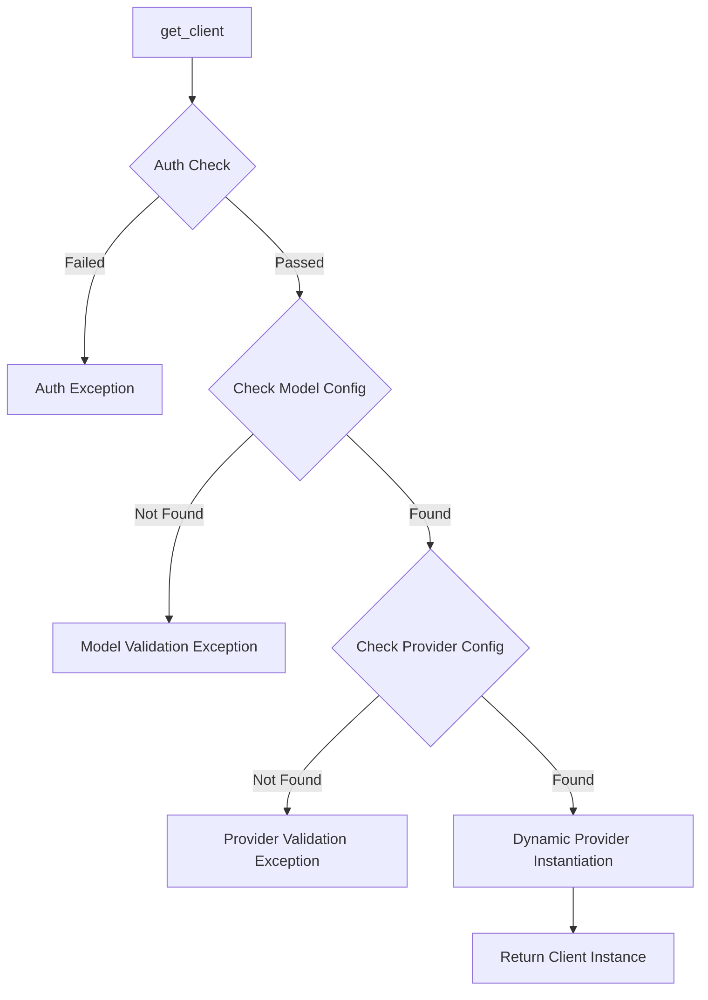

# Class ZCL_LLM_FACTORY

AI Generated documentation.

## Overview

The `zcl_llm_factory` class serves as a factory for creating LLM (Large Language Model) clients. It implements the `zif_llm_factory` interface and provides a single public method `get_client` to instantiate LLM clients based on specified models. The class follows the factory pattern and handles validation of model and provider configurations while enforcing authorization checks.

Key features:

- Singleton pattern implementation (private constructor)
- Model-based client instantiation
- Configuration validation
- Authorization checks
- Dynamic provider class instantiation

## Dependencies

- Database Tables:
  - ZLLM_CLNT_CONFIG: Stores client configurations
  - ZLLM_PROVIDERS: Stores provider configurations
- Interfaces:
  - zif_llm_factory: Factory interface
  - zif_llm_auth: Authorization interface
- Classes:
  - zcl_llm_common: Utility class for BADI handling
  - zcx_llm_validation: Validation exception class

## Details

The class implements a sophisticated factory pattern with multiple validation and configuration layers.

Key implementation aspects:

1. Authorization Layer:
   - Initialized during class construction via BADI
   - Performs pre-validation checks before client creation

2. Configuration Validation:
   - Two-step validation process checking both model and provider
   - Uses database tables for configuration storage
   - Throws specific validation exceptions for different error cases

3. Dynamic Provider Instantiation:
   - Uses dynamic method calls to create provider-specific clients
   - Passes both client and provider configurations to the instantiated class
   - Allows for flexible provider implementation without factory modifications

The class is designed to be extensible, allowing new providers to be added through configuration rather than code changes.
