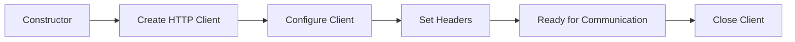
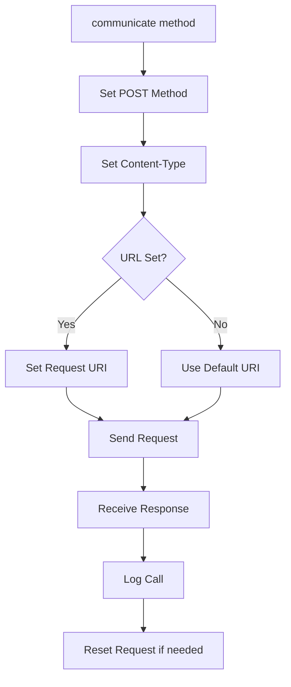

# Class ZCL_LLM_HTTP_CLIENT_WRAPPER

AI Generated documentation.
## Overview
The `zcl_llm_http_client_wrapper` class provides a wrapper for HTTP client functionality, specifically designed for LLM (Large Language Model) service communications. It encapsulates HTTP client handling, header management, and communication logging.

Public methods:
- `constructor`: Creates a new instance with client and provider configurations
- `get_client`: Creates and returns a new HTTP client wrapper instance
- `set_header`: Sets HTTP request headers
- `set_url`: Sets the target URL for the request
- `communicate`: Handles HTTP POST communication including request/response handling
- `close_client`: Closes the HTTP client connection

The class implements the `zif_llm_http_client_wrapper` interface and provides a standardized way to handle HTTP communications with LLM providers.

## Dependencies
- `if_http_client`: SAP standard HTTP client interface
- `zcx_llm_validation`: Custom exception class for validation errors
- `zcx_llm_http_error`: Custom exception class for HTTP errors
- `zif_llm_call_logger`: Interface for logging LLM calls
- `zllm_clnt_config`: Configuration structure for client settings
- `zllm_providers`: Configuration structure for provider settings

## Details
The class implements a robust HTTP client wrapper with several key features:

1. Session Management:

2. Communication Flow:

The class includes sophisticated error handling and logging mechanisms:
- HTTP communication failures are caught and transformed into specific exceptions
- All communications are logged through the call logger implementation
- Request headers are preserved between calls while maintaining security
- Response codes >= 300 are handled with detailed error messages
- The class supports RFC destination-based communication configuration

Special attention is given to maintaining state between requests by preserving non-SAP headers while cleaning up internal ones, making it suitable for stateful communications with LLM providers.

