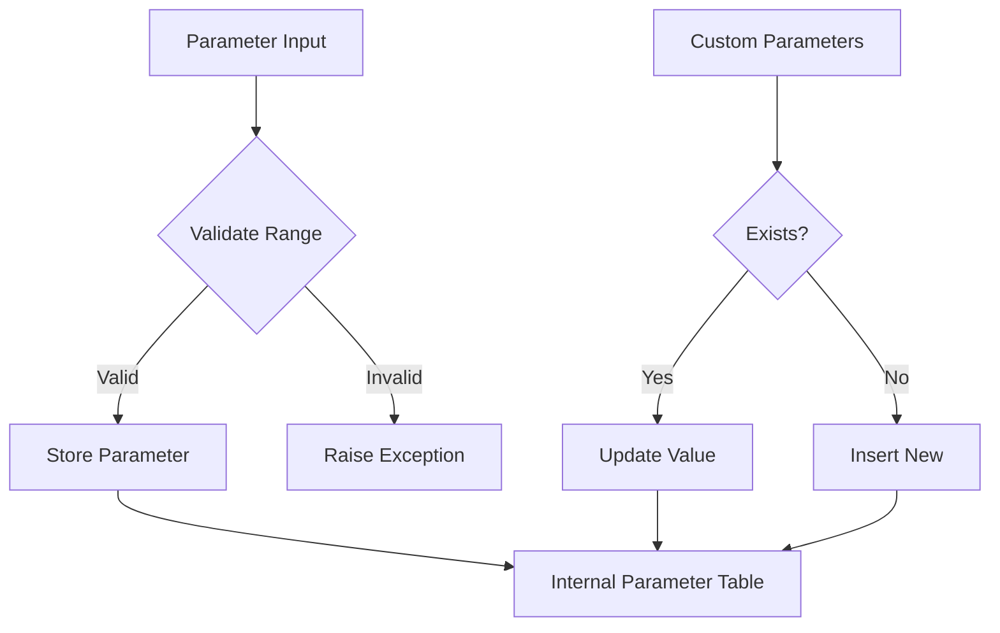

# Class ZCL_LLM_OPTIONS

AI Generated documentation.

## Overview

The `ZCL_LLM_OPTIONS` class manages configuration parameters for Large Language Model interactions. It provides methods to set and validate various LLM parameters such as temperature, top-p sampling, penalties, and custom parameters. The class implements the `ZIF_LLM_OPTIONS` interface.

Key public methods:

- `SET_TEMPERATURE`: Controls randomness (0.0-2.0)
- `SET_TOP_P`: Sets nucleus sampling parameter (0.0-1.0)
- `SET_TOP_K`: Sets top-k sampling parameter (min 1)
- `SET_SEED`: Sets random seed (min 0)
- `SET_FREQUENCY_PENALTY`/`SET_PRESENCE_PENALTY`: Control repetition (-2.0 to 2.0)
- `SET_MIN_P`: Sets minimum probability threshold (0.0-1.0)
- `SET_TOP_A`: Sets top-a sampling parameter (0.0-1.0)
- `SET_MAX_TOKENS`: Sets maximum output tokens (min 0)
- `SET_CUSTOM_PARAMETERS`: Allows setting arbitrary key-value parameters
- `GET_PARAMTERS`: Retrieves all stored parameters

## Dependencies

- `ZCX_LLM_VALIDATION`: Exception class for parameter validation
- `ZLLM_KEYVALUES`: Table type for storing key-value parameters

## Details

The class follows a parameter validation and storage pattern:

1. Each parameter setting method first validates the input
2. If valid, the parameter is stored in the internal parameter table
3. Custom parameters can override standard parameters

The class uses two validation helper methods:

- `VALIDATE_RANGE_FLOAT`: For decimal parameters with min/max bounds
- `VALIDATE_RANGE_INT`: For integer parameters with min/optional max bounds

All parameters are stored as strings in the internal table, with numeric values being converted during storage. This allows for a unified storage mechanism while maintaining type safety through the public interface.
