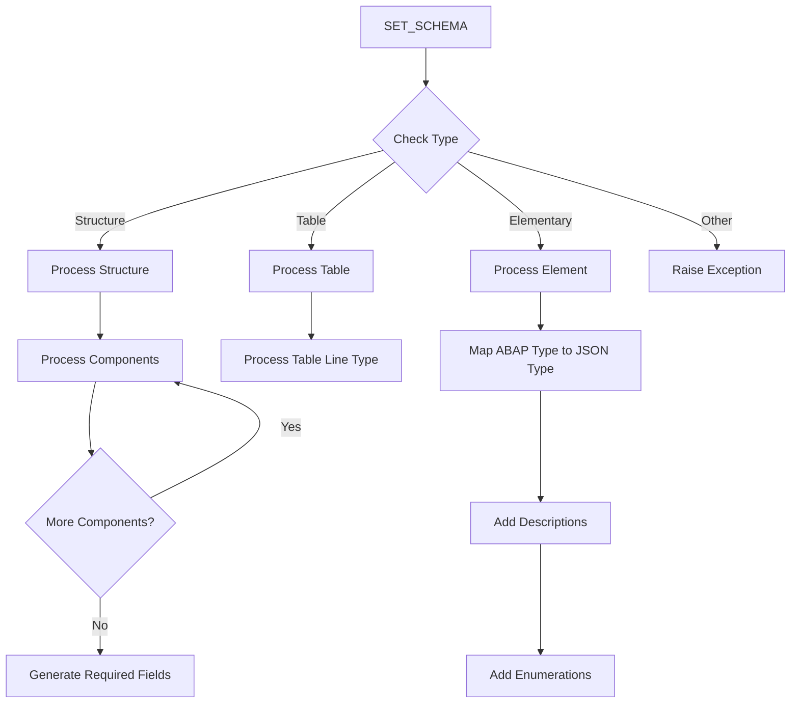

# Class ZCL_LLM_SO_JS

AI Generated documentation.

## Overview

The `ZCL_LLM_SO_JS` class implements a JSON Schema generator for ABAP data structures. It implements the `ZIF_LLM_SO` interface and provides functionality to:

1. Convert ABAP data structures to JSON Schema format (`SET_SCHEMA`)
2. Retrieve the generated JSON Schema (`GET_SCHEMA`)
3. Access the data type descriptor (`GET_DATATYPE`)

The class handles:

- Structure to JSON Schema conversion
- Table type conversion to array definitions
- Elementary type mapping (integers, floats, strings, booleans)
- Field descriptions and enumeration values
- Nested structure hierarchies
- Required field specifications
- Property naming and title generation

## Dependencies

- `ZIF_LLM_SO` interface
- `ZCX_LLM_VALIDATION` exception class
- ABAP Type Description classes (`CL_ABAP_TYPEDESCR` and its subclasses)

## Details

The class follows a recursive processing pattern to handle nested ABAP structures. The main processing flow can be visualized as:

The class uses a protected field info structure to track:

- Field names
- Field paths for nested structures
- Field descriptions

Key implementation aspects:

- Maintains case sensitivity handling through lowercase conversion
- Implements JSON Schema validation constraints
- Handles special cases for boolean fields
- Provides extension points through pre/post processing methods
- Generates proper JSON Schema syntax including commas and brackets
- Supports description escaping for JSON compatibility
- Implements strict schema validation with `additionalProperties: false`
