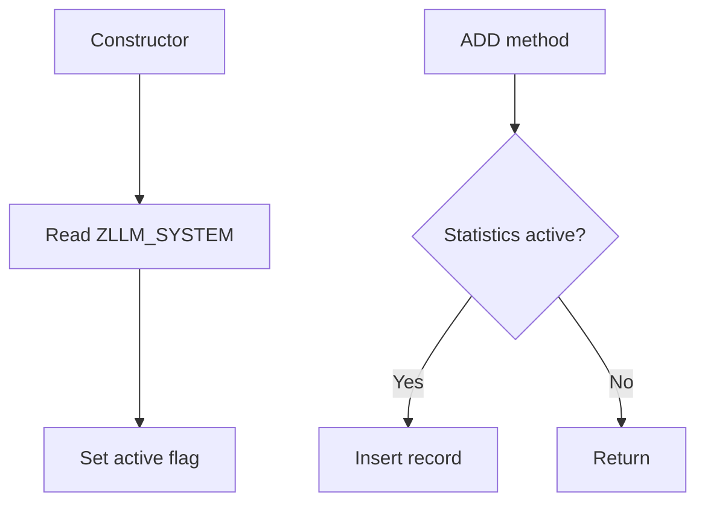

# Class ZCL_LLM_STATISTICS

AI Generated documentation.

## Overview

The `ZCL_LLM_STATISTICS` class provides functionality for collecting statistics data. It implements the `ZIF_LLM_STATISTICS` interface and offers:

- `ADD`: Method to insert statistics records into table ZLLM_STATISTICS
- Statistics collection can be globally enabled/disabled via system settings

The class automatically checks the active state during instantiation and prevents data collection when disabled.

## Dependencies

- Database Tables:
  - ZLLM_STATISTICS: Statistics records storage
  - ZLLM_SYSTEM: System configuration table
- Interface ZIF_LLM_STATISTICS

## Details

The class follows a simple control flow for statistics collection:

The active flag serves as a global switch to prevent unnecessary database operations when statistics collection is disabled. This design allows for runtime control of statistics gathering without code changes.

The class uses database table buffering and single record operations to optimize performance:

- Single read during instantiation
- Individual record inserts for statistics
