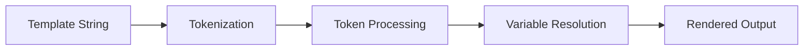
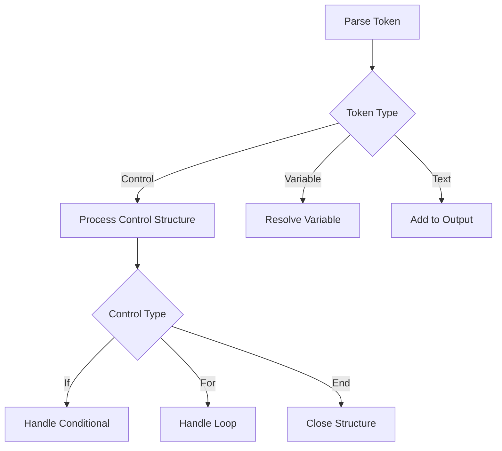

# Class ZCL_LLM_TEMPLATE_PARSER

AI Generated documentation.
## Overview
The `ZCL_LLM_TEMPLATE_PARSER` class implements a template engine based on a limited subset of Jinja2 syntax. It provides functionality to parse and render templates with variable substitution, conditional logic, and loops.

Public Methods:
- `CONSTRUCTOR`: Initializes an empty template collection
- `ADD_TEMPLATE`: Adds or replaces a template with given name and content
- `RENDER`: Renders a template using provided data context and returns the result

Key Features:
- Variable substitution with nested path support (`{{variable.path}}`)
- Conditional logic (``, ``, ``)
- Loop constructs (``)
- Filter functions (upper, lower, capitalize, default)
- Table formatting and access
- Escape character handling
- Comment support (`{# comment #}`)

## Dependencies
None - the class is self-contained and uses only standard ABAP functionality.

## Details
The template parser works in three main phases:

Internal Processing:
1. Tokenization splits template into:
   - TEXT tokens (plain text)
   - VARIABLE tokens ({{...}})
   - CONTROL tokens ()
   - COMMENT tokens ({#...#})

2. Control Structure Handling:

3. Variable Resolution:
- Supports nested path navigation (e.g., user.address.street)
- Handles different data types (elementary, structure, table)
- Provides loop metadata (index, first, last)
- Supports filters for value transformation

The parser maintains a control stack to track nested conditions and loops, ensuring proper scope handling and variable resolution context. Error handling is implemented throughout the processing chain with specific exception classes for different error scenarios.

