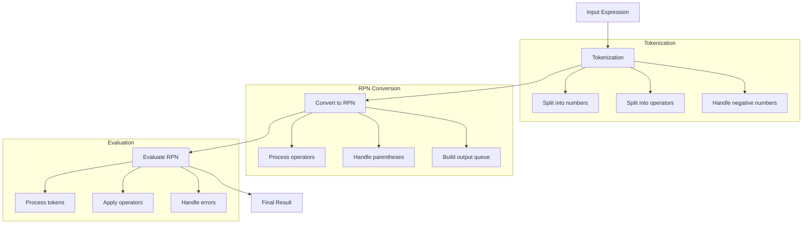

# Class ZCL_LLM_TOOL_CALCULATOR

AI Generated documentation.
## Overview
The `ZCL_LLM_TOOL_CALCULATOR` class implements a mathematical expression evaluator as a tool for LLM interactions. It implements the `ZIF_LLM_TOOL` interface and provides functionality to evaluate mathematical expressions with support for:

Public Methods:
- `ZIF_LLM_TOOL~GET_TOOL_DETAILS`: Returns tool configuration including name, description, and parameters
- `ZIF_LLM_TOOL~EXECUTE`: Processes the mathematical expression and returns the calculated result
- `ZIF_LLM_TOOL~GET_RESULT`: Returns the last calculated result

Supported Operations:
- Basic arithmetic (+, -, *, /)
- Power operations (**)
- Modulo operations (MOD)
- Parentheses for expression grouping
- Negative numbers
- Decimal numbers

## Dependencies
- Implements interface `ZIF_LLM_TOOL`
- Uses standard ABAP exceptions:
  - CX_SY_ZERODIVIDE
  - CX_SY_ARITHMETIC_ERROR
  - CX_SY_CONVERSION_NO_NUMBER

## Details
The calculator uses a two-step evaluation process based on the Shunting Yard algorithm:

Key Implementation Features:
- Uses DECFLOAT34 for high-precision calculations
- Implements operator precedence handling
- Comprehensive error handling for invalid expressions and mathematical errors
- Supports whitespace in expressions
- Maintains internal state for result retrieval
- Uses stack-based evaluation for complex expressions

The class processes expressions through tokenization, converts to Reverse Polish Notation (RPN), and then evaluates the RPN expression to produce the final result. This approach ensures proper handling of operator precedence and nested expressions.

