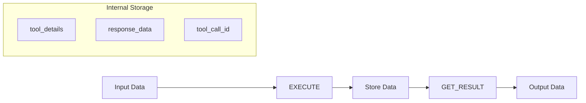

# Class ZCL_LLM_TOOL_ECHO

AI Generated documentation.

## Overview

The `ZCL_LLM_TOOL_ECHO` class implements the `ZIF_LLM_TOOL` interface and serves as an echo tool that returns provided data without modification. It provides the following public methods:

- `CONSTRUCTOR`: Initializes the tool with provided tool details
- `GET_TOOL_DETAILS`: Returns the tool configuration details
- `EXECUTE`: Processes the input data and returns it unchanged along with tool metadata
- `GET_RESULT`: Retrieves the stored response data with tool metadata

The class acts as a simple pass-through tool, maintaining tool details and response data between calls.

## Dependencies

- `ZIF_LLM_TOOL` interface - Main interface implemented by the class

## Details

The class follows a straightforward data flow pattern:

The class maintains internal state through instance attributes:

- `tool_details`: Stores configuration for the tool
- `response_data`: Holds the data passed through the tool
- `tool_call_id`: Maintains the tool call identifier
- `name`: Stores the tool name

The implementation is designed for scenarios where data needs to be passed through a tool interface while maintaining its original form, useful for testing or validation purposes.
