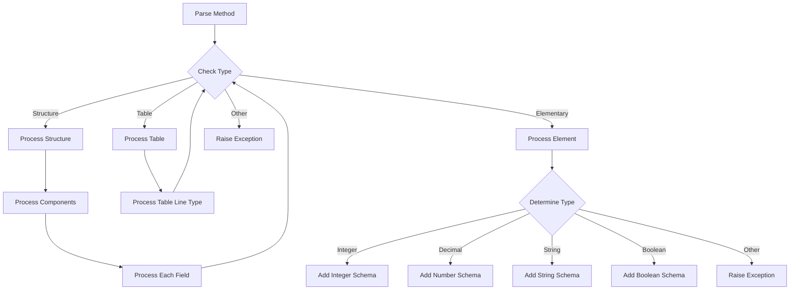

# Class ZCL_LLM_TOOL_PARSER

AI Generated documentation.

## Overview

The `ZCL_LLM_TOOL_PARSER` class is responsible for parsing ABAP data structures into JSON schema format. It implements the `ZIF_LLM_TOOL_PARSER` interface and provides functionality to convert various ABAP data types (structures, tables, elementary types) into their JSON schema representation.

Public methods:

- `PARSE`: The main entry point that converts an ABAP data structure into a JSON schema string. It handles field descriptions and supports various data types including:
  - Elementary types (INTEGER, DECIMAL, STRING, BOOLEAN)
  - Structures (including nested)
  - Tables
  - Enumerations

## Dependencies

- `ZIF_LLM_TOOL_PARSER`: Interface defining the parsing contract
- `ZCX_LLM_VALIDATION`: Exception class for validation errors
- `CL_ABAP_TYPEDESCR` and its subclasses for ABAP type inspection
- `CL_ABAP_FORMAT`: For JSON string escaping

## Details

The parser uses a recursive approach to process ABAP data structures. The processing flow can be visualized as follows:

Key implementation aspects:

- Uses a field_info structure to track field names, paths, and descriptions
- Maintains schema state through string concatenation
- Supports field descriptions and enumerations
- Implements pre/post hooks for objects, arrays, and schema processing
- Handles nested path construction for complex structures
- Enforces required fields and prevents additional properties
- Provides proper JSON schema formatting with titles and descriptions

The class uses a builder pattern to construct the JSON schema, with specialized processing for each ABAP type category while maintaining proper JSON structure and nesting.
