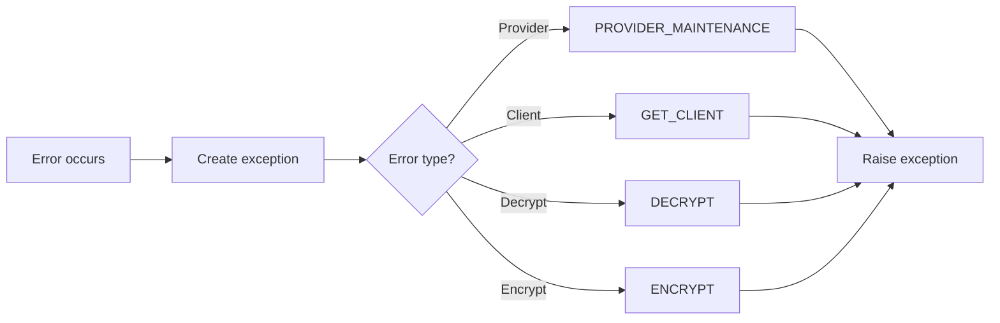

# Class ZCX_LLM_AUTHORIZATION

AI Generated documentation.

## Overview

`ZCX_LLM_AUTHORIZATION` is an exception class for handling authorization-related errors in an LLM (Large Language Model) integration context. The class inherits from `CX_STATIC_CHECK` and implements message interfaces `IF_T100_MESSAGE` and `IF_T100_DYN_MSG`.

The class defines four main error scenarios through constants:

- `PROVIDER_MAINTENANCE`: Provider maintenance related errors (message 018)
- `GET_CLIENT`: Client retrieval errors (message 019)
- `DECRYPT`: Decryption errors (message 020)
- `ENCRYPT`: Encryption errors (message 021)

Public methods:

- `CONSTRUCTOR`: Creates new exception instance with optional text ID and previous exception

## Dependencies

- Inherits from `CX_STATIC_CHECK`
- Implements `IF_T100_MESSAGE`
- Implements `IF_T100_DYN_MSG`
- Uses message class `ZLLM_CLIENT`

## Details

The class is designed to handle authorization errors in a structured way using SAP's message handling framework. All messages are defined in message class `ZLLM_CLIENT`.

The exception handling flow can be visualized as:

The class supports message variable substitution through `MSGV1` and `MSGV2` attributes, though only `GET_CLIENT` is configured to use `MSGV1` for dynamic message text.
