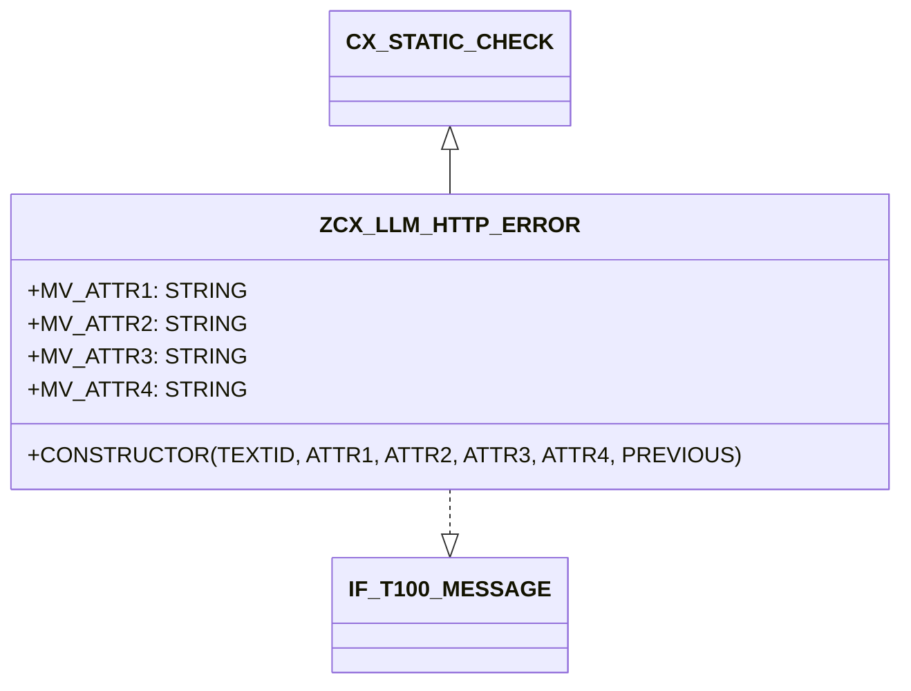

# Class ZCX_LLM_HTTP_ERROR

AI Generated documentation.
## Overview
`ZCX_LLM_HTTP_ERROR` is a custom exception class for handling HTTP-related errors. It inherits from `CX_STATIC_CHECK` and implements the `IF_T100_MESSAGE` interface for message handling. 

The class defines four main error scenarios through constants:
- `HTTP_CLIENT_NOT_INITIALIZED`: When HTTP client initialization fails
- `HTTP_COMMUNICATION_FAILURE`: For communication errors
- `HTTP_PROCESSING_FAILED`: When HTTP request processing fails
- `HTTP_OTHERS`: For handling other HTTP-related errors

Each error can store up to 4 string attributes (`MV_ATTR1` to `MV_ATTR4`) for additional error context.

Public methods:
- `CONSTRUCTOR`: Creates exception instance with optional text ID, attributes, and previous exception

## Dependencies
- Inherits from `CX_STATIC_CHECK`
- Implements `IF_T100_MESSAGE`
- Uses message class `ZLLM_CLIENT`

## Details
The class follows SAP's standard exception handling pattern with T100 messages. Each error constant defines:
- Message ID (`ZLLM_CLIENT`)
- Message number
- Attribute mappings

The constructor implementation ensures proper message handling by:
1. Calling the parent constructor with previous exception
2. Setting attribute values
3. Setting the text ID (using default if none provided)

