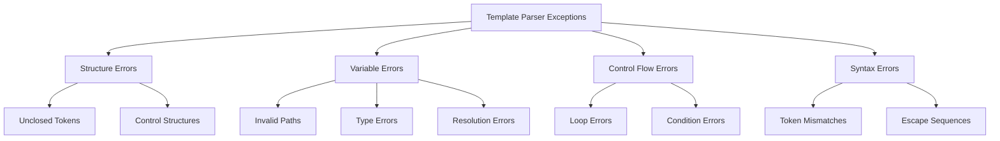

# Class ZCX_LLM_TEMPLATE_PARSER

AI Generated documentation.

## Overview

The `ZCX_LLM_TEMPLATE_PARSER` class is a custom exception class for handling template parsing errors. It inherits from `CX_STATIC_CHECK` and implements the message interfaces `IF_T100_DYN_MSG` and `IF_T100_MESSAGE`.

The class defines a comprehensive set of exception constants for various parsing scenarios:

- Template structure errors (unclosed tokens, control structures)
- Variable handling errors (invalid paths, types, resolution)
- Loop processing errors (syntax, collection handling)
- Conditional statement errors (evaluation, invalid operators)
- Token matching and escape sequence errors

Public methods:

- `CONSTRUCTOR`: Creates exception instance with optional text ID, previous exception and message variables

## Dependencies

- Inherits from `CX_STATIC_CHECK`
- Implements `IF_T100_DYN_MSG`
- Implements `IF_T100_MESSAGE`

## Details

The class uses message catalog `ZLLM_CLIENT` with message numbers ranging from 022-042 to provide detailed error information. The error handling is structured into main categories:

The exception handling supports message variable substitution through the `MSGV1-MSGV4` attributes, allowing for context-specific error messages. Most error constants are designed to use `MSGV1` for detailed error information, while some complex errors like `MISMATCHED_TOKEN` utilize multiple message variables.
