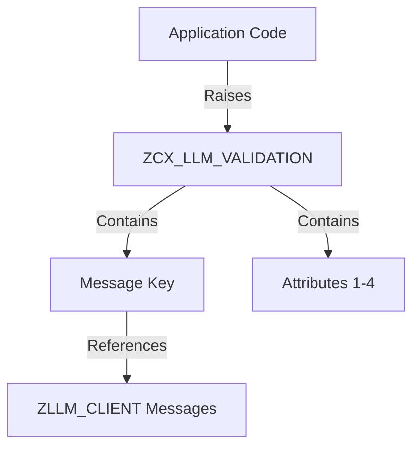

# Class ZCX_LLM_VALIDATION

AI Generated documentation.
## Overview
`ZCX_LLM_VALIDATION` is an exception class inheriting from `CX_DYNAMIC_CHECK` that handles various validation and error scenarios in an LLM (Large Language Model) client implementation. The class provides structured exception handling with predefined message types for:

- Type validation (`UNSUPPORTED_TYPE`)
- Value range validation (`VALUE_OUT_OF_RANGE`) 
- Model existence checks (`MODEL_DOES_NOT_EXIST`, `CLIENT_MODEL_NOT_FOUND`)
- HTTP communication issues (`HTTP_DESTINATION_ERROR`)
- Encryption/Decryption handling (`ENCRYPTION_SETUP`, `ENCRYPTION_FAILED`, `DECRYPTION_FAILED`)
- Provider validation (`PROVIDER_DOES_NOT_EXIST`)

Each exception type can carry up to 4 attributes (`MV_ATTR1` to `MV_ATTR4`) for detailed error information.

Public methods:
- `CONSTRUCTOR`: Creates exception instance with message ID and optional attributes

## Dependencies
- Inherits from `CX_DYNAMIC_CHECK`
- Implements `IF_T100_MESSAGE`
- Uses message class `ZLLM_CLIENT`

## Details
The class follows the SAP standard exception handling pattern with T100 messages. All message definitions are bound to the custom message class `ZLLM_CLIENT`.

Exception flow:

The exception handling is designed to provide detailed error information through a combination of:
- Predefined message IDs (msgid: ZLLM_CLIENT)
- Message numbers (msgno)
- Up to 4 dynamic attributes that can be referenced in the message text
- Previous exception handling for error chaining

The class is marked as `FINAL` to prevent inheritance, ensuring consistent error handling across the LLM client implementation.

