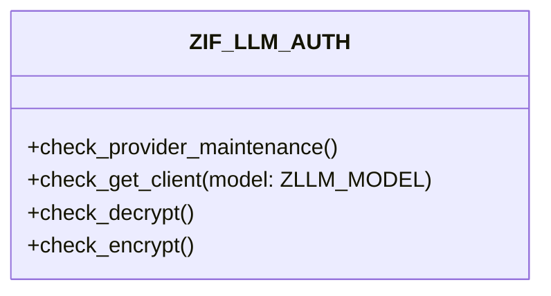

# Interface ZIF_LLM_AUTH

AI Generated documentation.
## Overview
Interface `ZIF_LLM_AUTH` provides authorization check methods for LLM (Large Language Model) operations. It exposes four methods:

- `CHECK_PROVIDER_MAINTENANCE`: Validates authorization for provider maintenance access
- `CHECK_GET_CLIENT`: Checks if user is authorized to obtain a model client for a specific LLM model
- `CHECK_DECRYPT`: Verifies authorization for secret decryption operations  
- `CHECK_ENCRYPT`: Validates authorization for secret encryption operations

All methods raise the `ZCX_LLM_AUTHORIZATION` exception if authorization checks fail.

## Dependencies
- Exception class: `ZCX_LLM_AUTHORIZATION`
- Data type: `ZLLM_MODEL`

